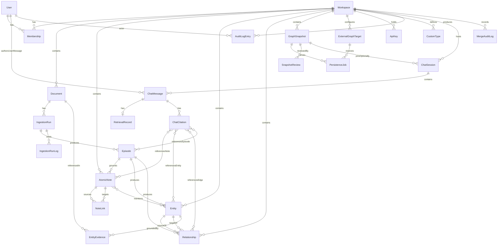

# zkast — Data Model

This document defines the **working-store** data model (technology-agnostic) and the **external-graph contract** that zkast writes to user-owned graph databases on persistence.

The working store holds everything zkast needs to operate: accounts, workspaces, documents, the staged graph, snapshots, and audit data. The external-graph contract defines what nodes, edges, and properties end up in Neo4j or Postgres+AGE when a user persists a snapshot.

This spec deliberately omits SQL DDL, ORM models, and Cypher. See [techstack.md](techstack.md) for the technologies chosen and [apis.md](apis.md) for how these entities are exposed.

## Overview

## Identity, Workspaces, and Access

### User

**Purpose**: An authenticated principal. In single-user self-hosted mode, exactly one synthetic user exists.

**Fields**:

- `id` (UUID, PK): Unique identifier.
- `email` (string, unique per deployment): Login identifier in multi-user mode. Nullable in single-user mode.
- `display_name` (string, nullable): Human-readable name.
- `auth_provider` (enum: `password`, `oauth_google`, `oauth_github`, `bypass`): How the user authenticates.
- `created_at`, `updated_at` (timestamp).
- `last_seen_at` (timestamp, nullable).

**Constraints**:

- Email is unique across users when not null.
- Exactly one user with `auth_provider = bypass` may exist in single-user mode.

### Workspace

**Purpose**: The top-level isolation boundary. All content (documents, notes, graphs) belongs to exactly one workspace.

**Fields**:

- `id` (UUID, PK).
- `name` (string, 1–80 chars).
- `slug` (string, unique per deployment, URL-safe).
- `description` (string, nullable, ≤ 500 chars).
- `pipeline_settings` (structured: chunk size, max notes per document, language, default LLM provider (P0 fixed to `cohere`), chat models for "small" and "large" tasks, embedding model, rerank model, optional `north_base_url` for the North Agents HTTP API — must be empty or an `https?` URL; North bearer credentials are **not** stored here).
- `created_at`, `updated_at`.

**Constraints**:

- `slug` is unique deployment-wide.
- A workspace always has at least one Owner Membership.

### Membership

**Purpose**: Joins a User to a Workspace with a role.

**Fields**:

- `id` (UUID, PK).
- `user_id` (FK -> User).
- `workspace_id` (FK -> Workspace).
- `role` (enum: `owner`, `editor`, `viewer`).
- `created_at`, `updated_at`.

**Constraints**:

- A `(user_id, workspace_id)` pair is unique.
- A workspace must always have at least one `owner` membership; the system rejects operations that would violate this.

### ApiKey

**Purpose**: An encrypted credential stored at the workspace level (LLM providers, external graph targets, future integrations).

**Fields**:

- `id` (UUID, PK).
- `workspace_id` (FK -> Workspace).
- `kind` (enum). The enum is forward-defined so future providers do not require a schema migration. **P0 supports `llm_cohere`, `target_neo4j`, `target_age`, and `north_bearer` (North Agents API token)** only. P1 enables: `llm_openai`, `llm_anthropic`, `llm_gemini`, `llm_ollama`, `llm_generic`. Records with unsupported kinds are rejected at write time in the current phase.
- `label` (string, ≤ 80 chars): User-visible name.
- `encrypted_secret` (opaque blob): Encrypted at rest with a per-deployment key.
- `metadata` (structured: base URL, model names — never includes the secret).
- `created_at`, `updated_at`, `last_used_at` (nullable).

**Constraints**:

- The secret is never returned by any API response, ever.
- Rotating a key updates `encrypted_secret` and `updated_at` atomically.
- At most one `north_bearer` key row exists per workspace (partial unique index).

## Ingestion Provenance

### Document

**Purpose**: An ingested source document: user-uploaded PDF, or a North conversation transcript imported as JSON.

**Fields**:

- `id` (UUID, PK).
- `workspace_id` (FK -> Workspace).
- `original_filename` (string).
- `mime_type` (string): `application/pdf` for PDFs; `application/json` for North transcript payloads.
- `source_kind` (enum: `pdf`, `north_conversation`): Discriminator for ingestion semantics.
- `agent_id` (FK -> NorthAgent, nullable): Required when `source_kind = north_conversation` (enforced by DB check); optional for PDFs.
- `north_conversation_id` (string, nullable): Upstream conversation id when imported from North.
- `north_metadata` (structured map, nullable): Display-oriented metadata (titles, external ids) for UI and audit.
- `raw_transcript_json` (structured, nullable): Parsed transcript payload retained for provenance / re-parse.
- `byte_size` (integer).
- `storage_uri` (string): Opaque pointer to object storage; never user-visible.
- `checksum` (string, SHA-256 hex).
- `page_count` (integer, nullable until parsed; may be null for JSON transcripts).
- `replaces_document_id` (FK -> Document, nullable): For re-ingestion of an updated version.
- `status` (enum: `queued`, `parsing`, `generating_notes`, `extracting_graph`, `building_graph`, `ready`, `failed`).
- `failure_reason` (string, nullable): Short human-readable error.
- `created_at`, `updated_at`.

**Constraints**:

- `source_kind = north_conversation` implies `agent_id` is not null.
- PDF rows continue to require PDF mime type per existing check constraints.

**Indexes**:

- `(workspace_id, created_at desc)` for listing.
- `(workspace_id, status)` for status filtering.
- Unique `(workspace_id, checksum)` to deduplicate uploads.
- `(workspace_id, source_kind)` for filtering by ingestion channel.

### IngestionRun

**Purpose**: A single attempt to process a Document through the pipeline. Multiple runs per Document are possible (retries, re-ingestion).

**Fields**:

- `id` (UUID, PK).
- `document_id` (FK -> Document).
- `started_at`, `ended_at` (timestamps).
- `status` (enum: `running`, `succeeded`, `failed`, `cancelled`).
- `pipeline_version` (string): Code version that produced this run.
- `llm_provider`, `llm_model_small`, `llm_model_large` (strings): Captured at start; immutable after.
- `stats` (structured: chunk count, note count, entity count, edge count, evidence_spans_linked).
- `trace_id` (string, nullable): OpenTelemetry trace identifier for diagnostics.
- `last_heartbeat_at` (timestamp, nullable): Updated every ~10s by the worker while the run is alive. Drives the worker-crash reconciler: an `IngestionRun` in `running` status whose heartbeat is older than ~90s is flipped to `failed` by a cron sweep.

### IngestionRunLog

**Purpose**: An append-only, durable timeline of structured events emitted by the pipeline for a given `IngestionRun`. Powers post-mortem diagnostics, the Settings → Diagnostics page, and is the persistent backing store behind the live pipeline-log drawer's `record_log` event channel. Metric events (entity count, token count, etc.) are streamed only and are intentionally **not** persisted here to keep the table cheap.

**Fields**:

- `id` (UUID, PK).
- `ingestion_run_id` (FK -> IngestionRun, cascade delete).
- `ts` (timestamp): When the log line was produced.
- `level` (enum: `info`, `warning`, `error`).
- `stage` (enum: `parsing`, `generating_notes`, `extracting_graph`, `building_graph`): Pipeline stage that produced the line.
- `message` (string, ≤ 2,000 chars): Human-readable line.
- `data` (structured map, nullable): Optional structured payload (e.g., `{"episode_index": 7, "delta_entities": 3}`).

**Constraints**:

- Append-only; no UPDATE or DELETE except via cascade.
- Retention: cleared when the parent `IngestionRun` is deleted (cascade); kept indefinitely otherwise.

**Indexes**:

- `(ingestion_run_id, ts desc)` for the per-run timeline.
- `(level, ts desc)` for error-only filters in Diagnostics.

### Episode

**Purpose**: A single chunk of source content with provenance. Mirrors Graphiti's "episode" concept. Every derived note, entity, and relationship traces back to one or more Episodes.

**Fields**:

- `id` (UUID, PK).
- `workspace_id` (FK -> Workspace).
- `document_id` (FK -> Document).
- `ingestion_run_id` (FK -> IngestionRun).
- `agent_id` (FK -> NorthAgent, nullable): Copied from the parent document for agent-scoped notes and retrieval.
- `kind` (enum): `pdf_chunk`, `manual_text`, plus North transcript slice kinds (`north_message`, `north_turn_window`, `north_tool_event`, …) for conversation-derived episodes.
- `text` (string): The raw chunk content.
- `page_start`, `page_end` (integers, nullable for manual): Source page references.
- `sequence` (integer): Order within the document.
- `created_at`.

**Indexes**:

- `(document_id, sequence)`.
- `(workspace_id, created_at desc)`.

## Atomic Notes (Zettelkasten Layer)

### AtomicNote

**Purpose**: A single atomic idea in Zettelkasten form. Generated by the LLM from one or more Episodes, or authored manually by the user.

**Fields**:

- `id` (UUID, PK).
- `workspace_id` (FK -> Workspace).
- `title` (string, 1–200 chars).
- `body` (string, markdown, ≤ 10,000 chars).
- `tags` (list of strings, normalized lowercase).
- `origin` (enum: `generated`, `manual`, `merged`, `split`): Provenance kind.
- `is_user_edited` (boolean): Has the user touched this note?
- `agent_id` (FK -> NorthAgent, nullable): When notes are generated from North-sourced episodes, ties the note to the owning agent for isolation and UI filters.
- `memory_context` (string, nullable): One-line A-MEM-style summary of how this note sits in agent memory (LLM-derived; immutable user body separately).
- `memory_keywords` (list of strings, nullable): Short concept keywords for retrieval and dreaming.
- `evolution_history` (list of structured entries, optional): Append-only audit of dreaming / consolidation events.
- `dreaming_touched_at` (timestamp, nullable): Last time offline dreaming mutated derived fields.
- `source_episode_ids` (list of FK -> Episode): Episodes that grounded this note.
- `created_by_user_id` (FK -> User, nullable).
- `created_at`, `updated_at`.

**Constraints**:

- A note with `origin = generated` must have at least one source episode.
- A note with `origin = manual` may have zero source episodes.

**Indexes**:

- `(workspace_id, updated_at desc)`.
- `(workspace_id, agent_id)` when scoping North agent notebooks.
- Full-text index on `(title, body)` for search.
- Tag inverted index for tag filtering.

### NoteLink

**Purpose**: A typed link between two AtomicNotes (Zettel-style references).

**Fields**:

- `id` (UUID, PK).
- `workspace_id` (FK -> Workspace).
- `source_note_id`, `target_note_id` (FK -> AtomicNote).
- `kind` (enum: `related`, `supports`, `refutes`, `extends`, `references`, `custom`).
- `custom_label` (string, nullable, required if `kind = custom`).
- `origin` (enum: `generated`, `manual`).
- `link_reason` (string, nullable): Human-readable justification when the link was proposed by enrichment or dreaming.
- `link_strength` (float, default 1.0): Relative weight for ranking / UI emphasis.
- `created_at`.

**Constraints**:

- `source_note_id != target_note_id` (no self-links).
- `(source_note_id, target_note_id, kind, custom_label)` is unique.

## Knowledge Graph Layer

### Entity

**Purpose**: A node in the working graph. Represents a person, organization, concept, location, work, date, or any custom-typed thing.

**Fields**:

- `id` (UUID, PK).
- `workspace_id` (FK -> Workspace).
- `type` (string): Standard (`Person`, `Organization`, `Concept`, `Location`, `Work`, `Date`, `Event`) or a CustomType key.
- `canonical_name` (string): Display label.
- `aliases` (list of strings): Other surface forms observed.
- `summary` (string, ≤ 2,000 chars): LLM-maintained description that evolves over time.
- `properties` (structured map): Type-specific properties (e.g., `Person.affiliation`).
- `source_episode_ids` (list of FK -> Episode).
- `source_note_ids` (list of FK -> AtomicNote).
- `created_at`, `updated_at`.
- `is_user_edited` (boolean).

**Constraints**:

- `(workspace_id, type, canonical_name)` is unique (deduplication invariant).
- Aliases within a workspace must be unique to one entity at a time.

**Indexes**:

- `(workspace_id, type, canonical_name)`.
- Trigram / fuzzy index on `canonical_name` and `aliases` for dedup suggestions.

### Relationship

**Purpose**: A typed, temporally-validated edge between two Entities.

**Fields**:

- `id` (UUID, PK).
- `workspace_id` (FK -> Workspace).
- `source_entity_id`, `target_entity_id` (FK -> Entity).
- `type` (string): Standard (`AUTHORED_BY`, `CITES`, `LOCATED_IN`, `PART_OF`, `RELATED_TO`, `OCCURRED_AT`) or a CustomType key.
- `fact` (string, ≤ 500 chars): Natural-language statement of the fact (Graphiti-style).
- `valid_from` (timestamp, nullable): When the fact became true. Null = unknown.
- `valid_to` (timestamp, nullable): When the fact stopped being true. Null = currently valid.
- `confidence` (float, 0–1): Extraction confidence.
- `source_episode_ids` (list of FK -> Episode).
- `source_note_ids` (list of FK -> AtomicNote).
- `origin` (enum: `generated`, `manual`).
- `created_at`, `updated_at`.
- `is_user_edited` (boolean).

**Constraints**:

- `source_entity_id != target_entity_id` unless the type explicitly permits self-loops.
- A relationship can be "ended" by setting `valid_to`; it must never be hard-deleted unless its provenance is also removed.

**Indexes**:

- `(workspace_id, source_entity_id, type)`.
- `(workspace_id, target_entity_id, type)`.
- `(workspace_id, valid_from, valid_to)` for temporal queries.

### EntityEvidence

**Purpose**: A character-offset span linking an `Entity` back to a specific passage in the source PDF that produced it. Co-extracted by LangExtract alongside Graphiti's typed extraction; surfaced in the entity detail panel as quoted snippets with a "View in document" jump. Provides the audit trail behind every entity in the graph — distinct from the looser `source_episode_ids` / `source_note_ids` lists, which only identify the originating chunks.

**Fields**:

- `id` (UUID, PK).
- `workspace_id` (FK -> Workspace, cascade delete).
- `entity_id` (FK -> Entity, cascade delete).
- `document_id` (FK -> Document, cascade delete).
- `episode_id` (FK -> Episode, nullable, cascade delete).
- `page` (integer): 1-based page number where the span starts.
- `char_start`, `char_end` (integers): Character offsets within the episode body where the verbatim span lies.
- `quote` (string, ≤ 600 chars): The verbatim snippet shown in the UI as a blockquote.
- `method` (string, default `langextract`): Reserved for future extractors (e.g., `gliner`, `rebel`).
- `attributes` (structured map): Optional typed attributes the extractor surfaced for this span (e.g., `{"identifier": "MRP-227"}` for a Standard).
- `created_at` (timestamp).

**Constraints**:

- `char_end >= char_start`.
- Cascade-delete with `entity_id`, `document_id`, and `episode_id` — when any of those go, the evidence row is meaningless and removed.

**Indexes**:

- `(entity_id, created_at desc)` for the per-entity evidence list in the detail panel.
- `(document_id, page)` for "evidence on page N of document X".
- `(workspace_id)` for cascade scoping.

### CustomType

**Purpose**: A workspace-defined entity or edge type.

**Fields**:

- `id` (UUID, PK).
- `workspace_id` (FK -> Workspace).
- `kind` (enum: `entity_type`, `edge_type`).
- `key` (string, slug, unique per workspace+kind): Stable identifier used in `Entity.type` / `Relationship.type`.
- `display_label` (string).
- `description` (string).
- `schema` (structured map): Optional property schema (field name -> type).
- `created_at`, `updated_at`.

**Constraints**:

- `(workspace_id, kind, key)` is unique.
- Built-in standard types cannot be shadowed by custom types.

## Snapshots and Persistence

### GraphSnapshot

**Purpose**: An immutable, named freeze of the working graph at a moment in time. The unit of persistence to external graph DBs.

**Fields**:

- `id` (UUID, PK).
- `workspace_id` (FK -> Workspace).
- `name` (string, 1–120 chars).
- `description` (string, nullable, ≤ 1,000 chars).
- `created_by_user_id` (FK -> User, nullable).
- `created_at`.
- `stats` (structured: entity count, relationship count, note count).
- `included_entity_ids` (opaque set ref): Set of entity ids captured.
- `included_relationship_ids` (opaque set ref): Set of relationship ids captured.
- `included_note_ids` (opaque set ref): Set of note ids captured.

**Constraints**:

- A snapshot is immutable after creation.
- The system stores enough information to reproduce the snapshot's contents byte-for-byte if needed.

**Indexes**:

- `(workspace_id, created_at desc)`.
- `(workspace_id, name)` unique.

### ExternalGraphTarget

**Purpose**: A user-owned graph database that the workspace can persist snapshots to.

**Fields**:

- `id` (UUID, PK).
- `workspace_id` (FK -> Workspace).
- `name` (string, ≤ 80 chars).
- `kind` (enum: `neo4j`, `postgres_age`).
- `connection_metadata` (structured: host, port, database, label/graph name, ssl mode — no secrets).
- `credential_api_key_id` (FK -> ApiKey): The encrypted credential set.
- `default_write_mode` (enum: `upsert`, `replace`): Default for new jobs targeting this target.
- `last_tested_at` (timestamp, nullable).
- `last_test_status` (enum: `ok`, `unreachable`, `unauthorized`, `permission_denied`, `unknown_error`, nullable).
- `created_at`, `updated_at`.

**Constraints**:

- A target cannot be deleted while a PersistenceJob referencing it is `running`.
- Secrets live only in the linked ApiKey, not in `connection_metadata`.

### PersistenceJob

**Purpose**: An asynchronous job that writes a GraphSnapshot to an ExternalGraphTarget.

**Fields**:

- `id` (UUID, PK).
- `workspace_id` (FK -> Workspace).
- `snapshot_id` (FK -> GraphSnapshot).
- `target_id` (FK -> ExternalGraphTarget).
- `write_mode` (enum: `upsert`, `replace`).
- `status` (enum: `queued`, `running`, `succeeded`, `partial`, `failed`, `cancelled`).
- `started_at`, `ended_at` (timestamps, nullable).
- `progress` (structured: nodes_written, edges_written, nodes_skipped, edges_skipped, warnings).
- `failure_reason` (string, nullable).
- `started_by_user_id` (FK -> User, nullable).
- `cancellation_requested_at` (timestamp, nullable).

**Indexes**:

- `(workspace_id, started_at desc)`.
- `(target_id, status)`.

## Chat with the Knowledge Graph

### ChatSession

**Purpose**: A persistent natural-language conversation between a user and the workspace's knowledge graph. Sessions are scoped to a workspace and optionally pinned to a `GraphSnapshot` for reproducibility.

**Fields**:

- `id` (UUID, PK).
- `workspace_id` (FK -> Workspace).
- `title` (string, 1–200 chars): Auto-generated from the first user message, editable.
- `created_by_user_id` (FK -> User, nullable).
- `scope` (structured map, nullable):
  - `document_ids` (list of FK -> Document, optional).
  - `tags` (list of strings, optional).
  - `entity_types` (list of strings, optional).
  - `edge_types` (list of strings, optional).
  - `valid_at` (timestamp, optional): Restrict retrieval to facts valid at this instant.
  - `pinned_snapshot_id` (FK -> GraphSnapshot, optional): Pin retrieval to a frozen snapshot.
  - `agent_id` (FK -> NorthAgent, optional): When set, GraphRAG / hybrid paths intersect candidate relationship evidence with documents owned by this agent so retrieval stays within one memory boundary.
- `share_visibility` (enum: `private`, `workspace_read`, `workspace_edit`): Default `private`. (`workspace_*` values are P1+.)
- `model_settings` (structured: chat model, embedding model, rerank model, retrieval `top_k`, citation threshold, `retrieval_mode` including `rag`, `raw_transcript`, `graph`, `hybrid`, `zettelkasten_notes`, `amem_lite`). Captured at session creation; per-message overrides are possible but rare.
- `created_at`, `updated_at`, `last_activity_at`.

**Constraints**:

- A session pinned to a snapshot continues to work even if the working graph drifts; the working graph's mutations do not retroactively change earlier messages.
- A session cannot be pinned to a snapshot from a different workspace.

**Indexes**:

- `(workspace_id, last_activity_at desc)` for the chat home list.
- `(workspace_id, created_by_user_id, last_activity_at desc)` for "my sessions" view.
- Full-text index on `(title)`.

### ChatMessage

**Purpose**: One turn in a `ChatSession`. Messages are append-only with one exception: the last assistant message can be **regenerated**, which adds a sibling alternate rather than overwriting history.

**Fields**:

- `id` (UUID, PK).
- `session_id` (FK -> ChatSession).
- `sequence` (integer): Order within the session, monotonically increasing.
- `role` (enum: `user`, `assistant`, `system`, `tool`): P0 uses `user` and `assistant` only.
- `parent_message_id` (FK -> ChatMessage, nullable): For regenerated assistant messages, points at the previous assistant message in the same turn position; the user message that prompted them is found via `sequence`.
- `is_active_alternate` (boolean): When multiple assistant messages share a sequence (regeneration), exactly one is marked active.
- `author_user_id` (FK -> User, nullable): For `user` messages only.
- `content` (string, markdown, ≤ 20,000 chars).
- `status` (enum: `pending`, `streaming`, `complete`, `cancelled`, `failed`, `refused`):
  - `pending`: Created, not yet started.
  - `streaming`: Tokens currently arriving.
  - `complete`: Finished successfully.
  - `cancelled`: User stopped streaming.
  - `failed`: Provider or pipeline error.
  - `refused`: Assistant declined to answer ungrounded (per FR-45).
- `failure_reason` (string, nullable).
- `effective_scope_snapshot` (structured map, nullable): The full scope (including any session-level overrides) under which this message was produced. Frozen at message time.
- `model_used` (string): The chat model that produced this message; null for user messages.
- `tokens_in`, `tokens_out` (integers, nullable): Reporting.
- `created_at`, `completed_at` (nullable).

**Constraints**:

- `(session_id, sequence)` is unique per `is_active_alternate = true` row; alternates share `sequence` but only one is active.
- `user` messages must have `author_user_id` set (when not in single-user bypass mode) and never carry citations or retrieval records.
- `assistant` messages must reference a `RetrievalRecord` unless their `status` is `refused`.

**Indexes**:

- `(session_id, sequence)` for ordered retrieval.
- `(session_id, created_at)`.

### RetrievalRecord

**Purpose**: An immutable record of what context was retrieved from the working graph for a given assistant message. Anchors reproducibility, audit, and the "Show retrieved context" UI.

**Fields**:

- `id` (UUID, PK).
- `workspace_id` (FK -> Workspace).
- `message_id` (FK -> ChatMessage, unique): The assistant message this record grounds.
- `retrieval_strategy` (string): Identifies the retrieval pipeline (e.g., `graphiti_hybrid_v1`).
- `query_text` (string): The (rewritten) query passed to retrieval.
- `retrieved_items` (list of structured): Each item:
  - `kind` (enum: `note`, `entity`, `relationship`, `episode`).
  - `id` (UUID): Foreign id matching `kind`.
  - `score` (float).
  - `excerpt` (string, ≤ 1,000 chars): The exact text passed to the LLM as a grounding document.
- `total_candidates` (integer): How many items were considered before truncation.
- `truncated` (boolean): Whether the candidate set was larger than `top_k`.
- `created_at`.

**Constraints**:

- The record is immutable.
- The referenced `note`, `entity`, `relationship`, or `episode` may be later deleted in the working graph; the record's stored `excerpt` is the durable representation.

**Indexes**:

- `(workspace_id, created_at desc)` for diagnostic browsing.
- `(message_id)` unique.

### ChatCitation

**Purpose**: A single citation produced by Cohere's grounded chat output. Anchors a span of the assistant's `content` to one or more zkast sources.

**Fields**:

- `id` (UUID, PK).
- `message_id` (FK -> ChatMessage).
- `text_start`, `text_end` (integers): Character offsets into `ChatMessage.content` for the cited span.
- `sources` (list of structured): Each source:
  - `kind` (enum: `note`, `entity`, `relationship`, `episode`, `document_page`).
  - `id` (UUID, nullable when `kind = document_page`).
  - `document_id` (FK -> Document, nullable; populated when grounded by an episode that traces to a document).
  - `page_start`, `page_end` (integers, nullable): Populated when `kind = document_page` or when an episode has page provenance.
  - `excerpt` (string, ≤ 500 chars): The portion of the source the grounder pointed to.
- `created_at`.

**Constraints**:

- Each citation has at least one source.
- `text_start < text_end` and both fall inside the message content.
- Citations are immutable; regenerating an assistant message produces a new message with its own citations.

**Indexes**:

- `(message_id)`.

### Notes on Chat and the Working Graph

- **Single-user-message-to-one-active-assistant invariant**: at any time, each `sequence` slot in a session has exactly one assistant message marked active. Alternates are siblings reachable through the same `sequence`.
- **Snapshot pinning**: when `pinned_snapshot_id` is set on the session, retrieval queries are answered against the snapshot's frozen contents, not the live working graph.
- **Cascade**: deleting a workspace cascades to all its sessions, messages, retrieval records, and citations. Deleting an underlying note/entity/edge does not delete prior citations referencing it; the citation continues to render the stored `excerpt` and shows a "Source no longer in graph" indicator in the UI.

## Review, Audit, and Operations

### SnapshotReview

**Purpose**: A user action that records a review decision for a `GraphSnapshot`. Persistence to an external graph DB is gated on an `approved` decision (configurable per workspace). Decisions are persisted (one per `(snapshot_id, reviewer_user_id)` pair, latest wins via `updated_at`); regenerating a snapshot does not erase its review history.

**Fields**:

- `id` (UUID, PK).
- `workspace_id` (FK -> Workspace, cascade delete).
- `snapshot_id` (FK -> GraphSnapshot, cascade delete).
- `reviewer_user_id` (FK -> User, nullable).
- `status` (enum: `approved`, `rejected`, `needs_changes`): The current decision. `needs_changes` denotes a soft block — the reviewer wants edits before approval, but the snapshot is not flat-out rejected.
- `rationale` (string, ≤ 2,000 chars, nullable): Free-text justification shown next to the badge.
- `created_at`, `updated_at`.

**Constraints**:

- `(snapshot_id, reviewer_user_id)` is unique; re-reviewing updates the existing row.
- Status transitions are unrestricted — a reviewer may flip from `rejected` to `approved` and back as the snapshot evolves between iterations.

**Indexes**:

- `(snapshot_id, updated_at desc)` for the latest-decision lookup.

### MergeAuditLog

**Purpose**: Captures pre-merge state for `Entity` and `AtomicNote` merges so the operation can be reversed long after the user-session that performed it. Powers the "Full undo" affordance in the merge dialogs and the `POST .../unmerge` API.

**Fields**:

- `id` (UUID, PK).
- `workspace_id` (FK -> Workspace, cascade delete).
- `kind` (enum: `entity`, `note`): Which canonical merge produced this audit row.
- `survivor_id` (UUID): `Entity.id` or `AtomicNote.id` of the survivor.
- `victim_payload` (structured map): Full pre-merge serialized victim row (canonical_name, summary, properties, aliases, tags, …) sufficient to reconstruct it.
- `survivor_pre_merge` (structured map): Survivor's mutable fields *before* the merge applied any survivor-overwrite choices, so a "revert survivor fields" undo is possible without a full unmerge.
- `incident_relationships` (structured map, nullable): For entity merges, the list of relationships whose endpoints were rewritten from victim to survivor — recorded so unmerge can restore them to the victim.
- `victim_provenance` (structured map, nullable): The `source_episode_ids` / `source_note_ids` / `entity_episodes` / `entity_notes` rows that pointed at the victim — restored on unmerge.
- `created_at` (timestamp).
- `undone_at` (timestamp, nullable): When an unmerge consumed this audit row. Audit rows are never deleted, only marked undone.

**Constraints**:

- Append-only; `undone_at` is the only field ever updated post-insert.
- A survivor with an `undone_at IS NULL` audit row is eligible for "Full undo" in the UI.

**Indexes**:

- `(workspace_id, kind, survivor_id, created_at desc)` for the per-survivor undo lookup.
- `(undone_at)` partial index for audit / reporting.

### AuditLogEntry

**Purpose**: Append-only record of significant actions in a workspace.

**Fields**:

- `id` (UUID, PK).
- `workspace_id` (FK -> Workspace).
- `actor_user_id` (FK -> User, nullable).
- `action` (enum: `member_invited`, `member_removed`, `member_re_roled`, `apikey_added`, `apikey_rotated`, `apikey_removed`, `target_added`, `target_removed`, `target_tested`, `snapshot_created`, `snapshot_persisted`, `pipeline_settings_changed`, `customtype_added`, `customtype_removed`, `chat_session_created`, `chat_session_deleted`, `chat_session_shared`, `chat_session_unshared`).
- `subject_kind` (string): The entity kind acted upon.
- `subject_id` (UUID): The entity id acted upon.
- `metadata` (structured: action-specific details; redacts secrets).
- `created_at`.

**Constraints**:

- Entries are append-only; no UPDATE or DELETE operations are exposed.

**Indexes**:

- `(workspace_id, created_at desc)`.
- `(workspace_id, action, created_at desc)`.

## External-Graph Contract

This is the schema zkast writes into the user's Neo4j or Postgres+AGE database when a PersistenceJob runs. It is **technology-neutral**: the same labels, properties, and edge types map cleanly to Cypher and to openCypher-on-AGE.

### Identification and Isolation

All zkast-managed nodes and edges carry these properties so that zkast can find and update them without disturbing the rest of the user's graph:

- `zkast_workspace_id` (string, UUID): Identifies the originating workspace.
- `zkast_snapshot_id` (string, UUID): The snapshot that wrote this object.
- `zkast_id` (string, UUID): Stable identity of the source Entity or Relationship.
- `zkast_origin` (string: `generated` or `manual`).

Persistence in `upsert` mode only touches objects where `zkast_workspace_id` matches the workspace being persisted.

### Node Labels and Properties

Each persisted Entity becomes a node with two labels: a stable base label `ZkastEntity` and its type-specific label.

**Base label**: `ZkastEntity`

**Base properties on every node**:

- `zkast_id`, `zkast_workspace_id`, `zkast_snapshot_id`, `zkast_origin` (see above).
- `name` (string): The canonical name.
- `aliases` (list of strings).
- `summary` (string).
- `created_at`, `updated_at` (ISO 8601 strings).

**Standard type-specific labels**:

- `Person` — properties: `affiliation` (optional), `birth_date` (optional).
- `Organization` — properties: `org_type` (optional), `founded_date` (optional).
- `Concept` — no required extra properties.
- `Location` — properties: `country` (optional), `coordinates` (optional, `[lat, lon]`).
- `Work` — properties: `work_type` (`paper`, `book`, `article`, optional), `published_date` (optional).
- `Date` — properties: `iso_date` (required).
- `Event` — properties: `event_date` (optional).

**Custom-type labels**: Each CustomType produces a label equal to its `key` in PascalCase plus a `ZkastCustom` second label for discovery. Property schemas declared on the CustomType become required/optional properties on the node.

### Edge Types and Properties

Each persisted Relationship becomes an edge with:

**Base properties on every edge**:

- `zkast_id`, `zkast_workspace_id`, `zkast_snapshot_id`, `zkast_origin`.
- `fact` (string).
- `confidence` (float).
- `valid_from`, `valid_to` (ISO 8601 strings, optional).
- `created_at`, `updated_at`.

**Standard edge types**:

- `AUTHORED_BY` — `(Work)-[AUTHORED_BY]->(Person)`
- `CITES` — `(Work)-[CITES]->(Work)`
- `LOCATED_IN` — `(Entity)-[LOCATED_IN]->(Location)`
- `PART_OF` — `(Entity)-[PART_OF]->(Entity)`
- `RELATED_TO` — symmetric edge between any two ZkastEntity nodes.
- `OCCURRED_AT` — `(Event)-[OCCURRED_AT]->(Date | Location)`

**Custom edge types**: Each custom edge type produces an edge type equal to its `key` in `SCREAMING_SNAKE_CASE`. Endpoint type constraints declared on the CustomType are enforced at write time.

### Provenance Subgraph (Optional)

When the user opts in (per-job flag), zkast also writes a parallel provenance subgraph:

- `ZkastDocument` nodes with: `zkast_document_id`, `title`, `original_filename`, `page_count`.
- `ZkastNote` nodes with: `zkast_note_id`, `title`, `body`, `tags`.
- Edges:
  - `(ZkastEntity)-[DERIVED_FROM]->(ZkastNote)`
  - `(ZkastEntity)-[DERIVED_FROM]->(ZkastDocument)`
  - `(Relationship-as-edge has corresponding source notes captured in `metadata`)`
  - `(ZkastNote)-[FROM_DOCUMENT]->(ZkastDocument)`

This subgraph is opt-in because it materially increases the size of the persisted graph.

### Write Modes

- **`upsert` (default)**: Match nodes/edges by `(zkast_workspace_id, zkast_id)`. Create missing, update changed, never delete.
- **`replace`**: Same as upsert, plus delete any node/edge with the workspace's `zkast_workspace_id` that is not in the snapshot. Requires explicit confirmation listing the delete count.

### Constraints Required in the Target DB

Persistence ensures (creating if missing) the following constraints in the target DB:

- Unique constraint on `(zkast_workspace_id, zkast_id)` for `ZkastEntity` nodes.
- Index on `zkast_workspace_id` on `ZkastEntity`.
- Index on `name` on `ZkastEntity`.

If the connected user lacks permission to create these, persistence reports the gap and refuses to write.

## Data Lifecycle and Retention

- **Soft-delete vs hard-delete**: Documents, Notes, Entities, and Relationships are hard-deleted from the working store on user request. Their provenance traces in audit logs remain.
- **Cascade rules**:
  - Deleting a Workspace deletes all Documents, Notes, Episodes, Entities, Relationships, Snapshots, Targets, ApiKeys, IngestionRunLogs, EntityEvidence, MergeAuditLog rows, SnapshotReviews, and AuditLogEntries within it. (Operator-level destructive operation; requires confirmation.)
  - Deleting a Document deletes its Episodes (cascade). Notes, Entities, and Relationships whose **only** provenance was the deleted document are then swept by a follow-up orphan-cleanup job that runs at the end of the delete flow. The sweep deliberately preserves any row with `is_user_edited = true` and any Relationship with `origin = manual`, so user-curated graph state survives source removal.
  - Deleting an Entity does not delete relationships; relationships pointing to it are marked broken and surfaced in the UI. EntityEvidence rows cascade with the Entity.
- **Retention of snapshots**: Snapshots are retained indefinitely until the user deletes them. Persisted external data is never touched by snapshot deletion.

## Validation Rules

- **Email** (User): RFC 5322 format, ≤ 320 chars.
- **Slug** (Workspace, CustomType): `[a-z0-9-]{1,80}`, no leading/trailing hyphens, no consecutive hyphens.
- **Tags** (AtomicNote): `[a-z0-9-]{1,40}`, normalized lowercase, deduped within a note.
- **Canonical name** (Entity): 1–200 chars, trimmed.
- **Connection metadata** (ExternalGraphTarget): Host must be a syntactically valid hostname or IP; port in 1–65535.
- **ChatSession title**: 1–200 chars, trimmed. Auto-generated titles use the first 80 chars of the first user message; the user may override.
- **ChatMessage content**: ≤ 20,000 chars. Empty user messages are rejected.

## North Agents and A-MEM Memory (Sprint A-C)

This section reflects the data shape shipped for North conversation ingestion, A-MEM-style note enrichment, and offline dreaming. The full requirements live in [openspecs/north-agents-amem.md](openspecs/north-agents-amem.md) and [dreaming.md](dreaming.md); the canonical entities below are additive to the core model above.

### NorthAgent

**Purpose**: Local registration of an external North agent. Acts as the memory isolation boundary for derived episodes, notes, links, retrieval embeddings, dreaming jobs, and evaluations.

**Fields:**

- `id` (UUID, PK): Internal agent id used as `agent_id` on other rows.
- `workspace_id` (UUID, FK).
- `external_agent_id` (text, required).
- `provider` (text, default `north`).
- `display_name` (text).
- `import_settings` (object, JSONB): Message-class filters and segmentation defaults.
- `sync_cursor` (text, nullable).
- `created_at`, `updated_at` (timestamp).

**Constraints:**

- Unique `(workspace_id, provider, external_agent_id)`.

### NorthConversationCache

**Purpose**: Raw North conversation payloads for replay, dedup, and reprocessing.

**Fields:**

- `id`, `workspace_id`, `agent_id` (FKs).
- `north_conversation_id` (text).
- `payload` (object, JSONB).
- `fetched_at` (timestamp).

**Constraints:**

- Unique `(agent_id, north_conversation_id)`.

### Document (North extensions)

In addition to the PDF fields above, North-derived documents carry:

- `source_kind` (text): `pdf` | `north_conversation`.
- `agent_id` (UUID, nullable FK): Required when `source_kind = north_conversation`.
- `north_conversation_id` (text, nullable).
- `north_metadata` (object): Titles, types, timestamps, filter snapshot, `ingest_content_hash` used for re-import dedup, and sync status surfaces.

### Episode (North extensions)

- `agent_id` (UUID, nullable FK): Copied from owning document/agent.
- `kind` (text): Adds `north_message`, `north_turn_window`, `north_tool_event` to PDF kinds.
- `source_content_hash` (text, nullable): Content hash for ingestible episode bodies.

### AtomicNote (A-MEM extensions)

- `agent_id` (UUID, nullable FK).
- `memory_context` (text, nullable): One-sentence derived context summary.
- `memory_keywords` (list of text): Salient concepts.
- `evolution_history` (object, JSONB, default empty array): Append-only audit of derived-field changes.
- `dreaming_touched_at` (timestamp, nullable): Last time dreaming updated derived memory for the note.

### NoteLink (extensions)

- `link_reason` (text, nullable): LLM or operator explanation.
- `link_strength` (float, default 1.0): Relative weight for retrieval and UI.

**Business Rule**: A link must not connect two notes that both have non-null `agent_id` values pointing to different agents.

### DreamJob

**Purpose**: Asynchronous offline memory-evolution run for one agent.

**Fields:**

- `id`, `workspace_id`, `agent_id` (FKs).
- `status` (enum): `running` | `succeeded` | `failed`.
- `stats` (object, JSONB): Summary counts (`notes_considered`, `pairs_considered`, `links_added`, `neighbors_updated`, `embeddings_refreshed`, `immutability_violations`, optional `pairs_cap_reached`).
- `failure_reason` (text, nullable).
- `started_at`, `ended_at` (timestamp).

### DreamJobMutation

**Purpose**: Audit row for each durable change made by a dreaming run.

**Fields:**

- `id`, `dream_job_id` (FK), `note_id` (FK).
- `mutation_type` (enum): `link_added` | `neighbor_patch`.
- `payload` (object, JSONB).
- `created_at` (timestamp).

### RetrievalEmbedding (North extensions)

- `agent_id` (UUID, nullable): Propagated for North raw chunks and note embeddings so agent-scoped retrieval can filter without joins.

### Chat retrieval modes

`chat_messages.retrieval_mode` allows: `rag`, `graph`, `hybrid`, `raw_transcript`, `zettelkasten_notes`, `amem_lite`.

## Related Specifications

- [prd.md](prd.md) — Functional requirements implemented by this model.
- [apis.md](apis.md) — How these entities are exposed via APIs.
- [techstack.md](techstack.md) — Storage technologies and their rationale.
- [userstories.md](userstories.md) — Stories grounded in these entities.
- [openspecs/north-agents-amem.md](openspecs/north-agents-amem.md) — North and A-MEM requirements.
- [dreaming.md](dreaming.md) — Dreaming requirements.
