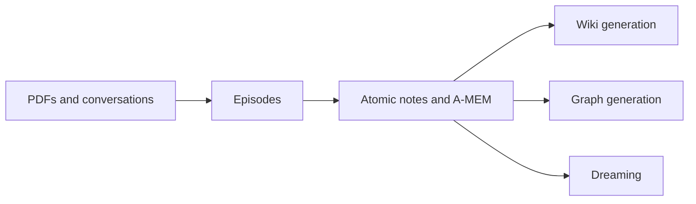

# LLM Wiki Memory Specification

## Overview

zkast supports multiple pluggable memory processors over the same immutable source spine (PDFs, North conversations, episodes, atomic notes). **LLM Wiki Memory** is a new processor that compiles atomic notes into a **persistent, human-readable wiki**: an interlinked collection of generated pages (entities, topics, source summaries, comparisons, indexes, and a changelog) maintained by the system across ingestions.

Unlike retrieval-time RAG, the wiki is **compiled once and kept current**: when new sources arrive, dependent pages are updated, links are revised, contradictions are flagged, and the synthesis evolves. The wiki is a compounding artifact — every source and every well-formed question can leave a durable trace.

LLM Wiki runs as a sibling processor to Graph generation and Dreaming. All three consume atomic notes and may run in parallel for the same workspace or agent scope.

## Requirements

### Functional Requirements

- **FR-1**: Operators can generate or refresh a **Wiki** for a workspace, optionally scoped to one North agent, one document, or one conversation.
- **FR-2**: Wiki generation must run **asynchronously** as a job and must not block user interaction.
- **FR-3**: Wiki generation may run **in parallel** with Graph generation and Dreaming for the same source set.
- **FR-4**: Wiki generation must read from **immutable** atomic notes, episodes, and source documents; it must not mutate any source artifact.
- **FR-5**: The system must produce multiple **page types**: source summary pages, entity pages, topic/concept pages, comparison or synthesis pages, an index page, and a changelog page.
- **FR-6**: Generated pages must carry **provenance** that links each page back to the atomic notes, episodes, documents, conversations, and agents that contributed to it.
- **FR-7**: Generated pages may include **typed links** to other wiki pages (related, contains, contradicts, supports, supersedes, references).
- **FR-8**: When new sources are ingested or existing sources are removed, dependent wiki pages must be **marked stale** or **regenerated** so the wiki stays consistent with the source set.
- **FR-9**: The system must support a **lint/maintenance** operation that detects contradictions across pages, stale claims, orphan pages, missing topic pages, and missing backlinks.
- **FR-10**: Operators can **browse**, **search**, and **read** generated pages in a dedicated Wiki surface in the application.
- **FR-11**: Operators can **inspect citations** for any page, resolving each citation back to its source artifact in zkast.
- **FR-12**: Operators can **delete** a Wiki space or any generated page; deletion must not affect source documents, episodes, or atomic notes.
- **FR-13**: Chat and retrieval flows may optionally use generated wiki pages as a memory source under the standard retrieval-mode and scope controls.
- **FR-14**: Wiki generation must publish **verbose telemetry** to the shared job event stream while running, so users can follow progress in the docked pipeline log on the Wiki surface.
- **FR-15**: Each durable change made by Wiki generation or lint must be recorded as an **auditable mutation**.

### Non-Functional Requirements

- **NFR-1**: **Source immutability** — Wiki generation must never modify atomic notes, episodes, documents, conversations, or other source artifacts.
- **NFR-2**: **Auditability** — every generated or revised page must be traceable to a Wiki job and source artifacts.
- **NFR-3**: **Isolation** — when a Wiki space is scoped to a single North agent, no source artifact from a different agent may contribute to its pages.
- **NFR-4**: **Bounded work** — Wiki generation must respect configurable caps on notes considered, pages touched per run, and LLM calls per page.
- **NFR-5**: **Telemetry** — Wiki jobs must publish enough events to distinguish setup, per-page progress, citation resolution, link creation, completion, and failure.
- **NFR-6**: **Recoverability** — failed Wiki jobs must surface a failure reason and a recovery path; partial progress should remain inspectable.
- **NFR-7**: **Portability** — page content must be expressible in a portable, plain-text representation suitable for export, version control, and rendering in standard Markdown viewers.
- **NFR-8**: **Concurrency safety** — Wiki, Graph, and Dreaming jobs that read the same atomic notes must coexist; the Wiki processor must not depend on Dreaming or Graph generation completing first, but should incorporate their results when present.

## Data Model

### Wiki Space

**Purpose**: A maintained collection of generated pages for one workspace and optional scope.

**Fields:**

- `id` (identifier, required): Unique wiki-space identifier.
- `workspace_id` (identifier, required): Owning workspace.
- `agent_id` (identifier, nullable): Scoped wiki for one North agent when set; workspace-wide when null.
- `scope_kind` (enum, required): One of `workspace`, `agent`, `document`, `conversation`.
- `scope_target_id` (identifier, nullable): Document or conversation id for document- and conversation-scoped spaces.
- `name` (text, required): Human label for the wiki space.
- `status` (enum, required): One of `empty`, `generating`, `ready`, `stale`, `failed`.
- `last_generated_at` (timestamp, nullable): Time of last successful generation pass.
- `settings` (object, nullable): Generation defaults (caps, page-type toggles, locale, lint cadence).
- `created_at`, `updated_at` (timestamp).

**Constraints:**

- A wiki space belongs to exactly one workspace.
- An agent-scoped wiki space must reference an agent in the same workspace.
- Unique on `(workspace_id, scope_kind, scope_target_id)` where `scope_target_id` is interpreted as `agent_id` when `scope_kind = agent`.

### Wiki Page

**Purpose**: One generated, human-readable page within a wiki space.

**Fields:**

- `id` (identifier, required).
- `wiki_space_id` (identifier, required).
- `slug` (text, required): URL-safe identifier within the wiki space.
- `title` (text, required): Display title.
- `page_type` (enum, required): One of `source_summary`, `entity`, `topic`, `synthesis`, `comparison`, `index`, `changelog`.
- `body` (text, required): Portable plain-text representation of the page content with frontmatter and typed links.
- `summary` (text, nullable): One-paragraph summary used in indexes and search.
- `status` (enum, required): One of `draft`, `ready`, `stale`, `archived`, `failed`.
- `confidence` (number, nullable): Optional model confidence between 0 and 1.
- `metadata` (object, nullable): Tags, locale, model name, generation run id, last-citation count.
- `created_at`, `updated_at` (timestamp).

**Constraints:**

- Unique `(wiki_space_id, slug)`.
- A page must reference an existing wiki space.
- Page body must remain authored by the Wiki processor; user edits are out of scope for this spec.

### Wiki Page Source

**Purpose**: Citation/provenance row linking a page to a contributing source artifact.

**Fields:**

- `id` (identifier, required).
- `wiki_page_id` (identifier, required).
- `source_kind` (enum, required): One of `atomic_note`, `episode`, `document`, `conversation`, `agent`, `dream_mutation`, `entity`, `relationship`.
- `source_id` (identifier, required): Identifier in the corresponding source table.
- `quote` (text, nullable): Short excerpt or claim attributed to this source.
- `weight` (number, nullable): Optional relative contribution weight.
- `created_at` (timestamp).

**Constraints:**

- Every wiki page must have at least one source row when its status is `ready`.
- Source rows must reference durable zkast provenance.

### Wiki Generation Job

**Purpose**: One asynchronous Wiki generation or maintenance run.

**Fields:**

- `id` (identifier, required).
- `workspace_id` (identifier, required).
- `wiki_space_id` (identifier, required).
- `kind` (enum, required): One of `generate`, `refresh`, `lint`, `regenerate_page`.
- `status` (enum, required): One of `queued`, `running`, `succeeded`, `failed`, `cancelled`.
- `stats` (object, nullable): Counts such as `notes_considered`, `pages_created`, `pages_updated`, `pages_marked_stale`, `links_added`, `citations_added`, `contradictions_detected`, `llm_calls`.
- `failure_reason` (text, nullable).
- `started_at`, `ended_at` (timestamp, nullable).

**Constraints:**

- A wiki job belongs to exactly one wiki space.
- A terminal job must include final stats.

### Wiki Mutation

**Purpose**: Audit row for each durable change made by a Wiki job.

**Fields:**

- `id` (identifier, required).
- `wiki_job_id` (identifier, required).
- `wiki_page_id` (identifier, required).
- `mutation_type` (enum, required): One of `page_created`, `page_updated`, `page_renamed`, `page_archived`, `link_added`, `link_removed`, `citation_added`, `contradiction_flagged`, `page_marked_stale`.
- `payload` (object, required): Mutation-specific metadata (diff summary, link kind, citation reference, etc.).
- `created_at` (timestamp).

**Constraints:**

- Every wiki mutation must reference an existing wiki job and wiki page.

### Wiki Link

**Purpose**: Typed relationship between two wiki pages.

**Fields:**

- `id` (identifier, required).
- `source_page_id` (identifier, required).
- `target_page_id` (identifier, required).
- `kind` (enum, required): One of `related`, `contains`, `contradicts`, `supports`, `supersedes`, `references`.
- `reason` (text, nullable).
- `strength` (number, nullable).
- `created_at` (timestamp).

**Constraints:**

- Source and target pages must belong to the same wiki space.
- Source and target must be different pages.
- A link must be auditable via a `link_added` mutation.

## Business Rules

### Rule: Source immutability

**Description**: Wiki generation and lint may only create, update, or archive wiki pages, links, citations, and mutations. They must not modify atomic notes, episodes, documents, or other source artifacts.

**Applies To**: Every Wiki job kind.

**Validation**: Wiki jobs touch only wiki-domain tables and citation rows; integration tests confirm no writes to source tables.

### Rule: Scope isolation

**Description**: An agent-scoped wiki space must derive its pages exclusively from atomic notes, episodes, and documents in that agent's scope.

**Applies To**: Wiki generation and lint.

**Validation**: Source-selection queries filter by `agent_id` when the wiki space is agent-scoped; cross-agent citations are rejected.

### Rule: Source-backed pages

**Description**: A wiki page with status `ready` must have at least one citation linking back to a durable zkast source artifact.

**Applies To**: Page creation and update.

**Validation**: Job must not mark a page `ready` without persisting at least one wiki page source row.

### Rule: Staleness on source change

**Description**: When a source document, conversation, or atomic note is removed or replaced, any wiki page citing that source must be marked stale or regenerated.

**Applies To**: Source delete, re-import, and re-generation flows.

**Validation**: Source-change events emit follow-up wiki mutations or a refresh job for affected pages.

### Rule: Audit trail

**Description**: Every durable change (page create/update/archive, link add/remove, citation add, contradiction flag, stale mark) must produce a wiki mutation row.

**Applies To**: Generation, refresh, lint, and single-page regeneration.

**Validation**: Job stats must reconcile with the count of related wiki mutation rows.

## User Flows

### Flow: Generate a wiki

**Trigger**: Operator opens the Wiki surface and triggers generation for the current scope (workspace, agent, document, or conversation).

**Preconditions:**

- The selected scope has atomic notes available.
- Required model credentials are configured.

**Steps:**

1. System creates a Wiki generation job in `queued` state.
2. System loads atomic notes (and A-MEM context where available) for the scope.
3. System selects candidate page types: source summaries, entities, topics, syntheses, comparisons.
4. For each candidate, system drafts or updates the page body, attaches citations to source artifacts, and records typed links to related pages.
5. System updates the index page and appends an entry to the changelog page.
6. System finalizes the job with `succeeded` or `failed` status and final stats.

**Success Outcome**: Generated pages are visible in the Wiki surface with citations and links; the index and changelog reflect the run.

**Error Outcomes**: Job fails with a visible failure reason; pages partially written remain inspectable as `draft` or `failed`.

### Flow: Browse and inspect the wiki

**Trigger**: Operator opens the Wiki surface.

**Steps:**

1. System lists wiki spaces available for the current workspace.
2. Operator selects a wiki space.
3. System shows the index page, recent changelog entries, and a searchable page list.
4. Operator opens a page and inspects body, links, and citations.
5. Operator can navigate to any citation and resolve it to the underlying note, episode, document, conversation, or agent in zkast.

**Success Outcome**: Operator can read generated pages and trace every claim back to source.

### Flow: Refresh on source change

**Trigger**: A source document, conversation, or atomic note changes (new ingest, re-import, deletion).

**Steps:**

1. System identifies wiki pages that cite the affected source.
2. System marks each dependent page stale and optionally enqueues a refresh job.
3. Refresh job re-evaluates affected pages, updates bodies and citations, and records mutations.
4. Pages either return to `ready` or remain `stale`/`archived` if the source was removed.

**Success Outcome**: Wiki stays consistent with the source set without manual cleanup.

### Flow: Lint and maintenance

**Trigger**: Operator triggers a Wiki lint job for a wiki space.

**Steps:**

1. System scans the wiki for contradictions across pages, stale pages, orphan pages, missing topic pages, and missing backlinks.
2. System creates wiki mutations for each finding (e.g. `contradiction_flagged`, `page_marked_stale`).
3. System updates the changelog with a lint summary.

**Success Outcome**: Lint findings are visible on affected pages and in a lint summary in the changelog.

### Flow: Watch wiki telemetry

**Trigger**: A Wiki job is running and the operator is on the Wiki surface.

**Steps:**

1. UI subscribes to the Wiki job event stream.
2. System emits start, candidate-selection, per-page, citation, link, lint, and completion events.
3. Operator can tell which phase the job is in and which page is being processed.

**Success Outcome**: Operator can follow Wiki generation in real time without leaving the Wiki page.

## Authorization

### Permission: Manage Wiki

**Required Role**: Workspace member with the same authority that may run Dreaming or Graph generation today.

**Resource-Level**: Only the workspace's own wiki spaces, pages, jobs, and mutations.

**Enforcement**: Server routes verify workspace membership before any Wiki-related internal pipeline call.

## Validation Rules

### Field: Wiki Page slug

- **Required**: Yes.
- **Format**: URL-safe lowercase identifier within the wiki space.
- **Custom Rules**: Slugs are unique within a wiki space; renames must record a `page_renamed` mutation.

### Field: Wiki Page page_type

- **Required**: Yes.
- **Allowed Values**: `source_summary`, `entity`, `topic`, `synthesis`, `comparison`, `index`, `changelog`.

### Field: Wiki Generation Job kind

- **Required**: Yes.
- **Allowed Values**: `generate`, `refresh`, `lint`, `regenerate_page`.

### Field: Wiki Link kind

- **Required**: Yes.
- **Allowed Values**: `related`, `contains`, `contradicts`, `supports`, `supersedes`, `references`.

### Field: Wiki Mutation mutation_type

- **Required**: Yes.
- **Allowed Values**: `page_created`, `page_updated`, `page_renamed`, `page_archived`, `link_added`, `link_removed`, `citation_added`, `contradiction_flagged`, `page_marked_stale`.

## User Interface Requirements

### Navigation

- A new primary left-rail item labeled **Wiki** appears between **Graph** and **Chat**.
- The item is available at the workspace level and also as a context action on Agent detail (e.g. "Open agent wiki").

### View: Wiki list

**Purpose**: Discover and open wiki spaces available in the workspace.

**Display Elements:**

- One row per wiki space showing name, scope (workspace, agent, document, conversation), status, last generated time, page count.
- Create / refresh actions when the user has permission.

**States:**

- `Empty`: no wiki spaces yet; surface guidance and a "Generate wiki" action.
- `Loading`, `Ready`, `Error`.

### View: Wiki space detail

**Purpose**: Read generated pages, follow citations, and operate the wiki.

**Display Elements:**

- Wiki space header with scope, status, last generated time, and counts.
- Search/index area listing pages by type with filtering.
- Page reader pane for the selected page including body, typed links, and a citation sidebar.
- Citation sidebar resolving each citation back to its zkast source artifact.
- Action area for **Generate**, **Refresh**, **Lint**, and **Regenerate this page**.
- A docked **pipeline log** at the bottom of the surface, mirroring the placement on Conversations, Jobs, and Agent detail.

**States:**

- `Empty`: wiki space exists but has no pages yet.
- `Generating`: a Wiki job is active for this space; pipeline log is live.
- `Ready`: pages are available; lint findings may be present.
- `Stale`: dependent sources changed; refresh recommended.
- `Failed`: last job ended with `failed`; reason and recovery guidance visible.
- `Partially generated`: some pages are `draft` or `failed`; the rest are `ready`.

### Page reader

- Renders the portable page body with typed wiki links and headings.
- Wiki links open the linked page within the same wiki space.
- A side panel lists citations with quote/excerpt previews and a path back to the source artifact.

### Accessibility

- All Wiki controls follow zkast's existing keyboard and screen-reader practices.
- Status changes and job progress are surfaced via accessible live regions where appropriate.

## Telemetry Requirements

A running Wiki generation, refresh, regenerate-page, or lint job must publish events sufficient to follow progress in the pipeline log.

### Job lifecycle events

- Job queued.
- Job started (includes scope and kind).
- Job completed with summary stats.
- Job failed with reason.
- Job cancelled (if cancellation is supported).

### Setup events

- Notes loaded for the scope (count).
- Candidate pages selected (count and types).
- Limits applied (caps used for this run).
- Model/embedding identifiers used (without secrets).

### Per-page events

- Page evaluated.
- Page created.
- Page updated.
- Page skipped (with reason: unchanged, low confidence, missing sources).
- Page marked stale.
- Page archived.
- Per-page progress for long pages (incremental progress updates).

### Citation and link events

- Citation attached to page.
- Wiki link added (typed kind).
- Wiki link removed.

### Maintenance events

- Contradiction flagged between pages.
- Orphan page detected.
- Missing topic page detected.
- Index page updated.
- Changelog entry appended.

### Aggregate stats (on completion)

- `notes_considered`.
- `pages_created`.
- `pages_updated`.
- `pages_skipped`.
- `pages_marked_stale`.
- `links_added`.
- `citations_added`.
- `contradictions_detected`.
- `llm_calls`.
- `embeddings_refreshed` (when wiki content is indexed for retrieval).

## Edge Cases

### Case: No atomic notes in scope

**Scenario**: The scope has no atomic notes.

**Expected Behavior**: Wiki job completes successfully with a `notes_considered = 0` stat and no page mutations; status returns to `empty` rather than `failed`.

### Case: Source deleted mid-run

**Scenario**: A source artifact is deleted while a Wiki job is running.

**Expected Behavior**: The job either marks affected pages stale or surfaces a partial-success state; subsequent refresh resolves the inconsistency.

### Case: Conflicting claims across sources

**Scenario**: Two sources contradict each other.

**Expected Behavior**: System creates or updates a relevant page that records the contradiction with citations to both sources and emits a `contradiction_flagged` mutation.

### Case: Concurrent Dreaming/Graph runs

**Scenario**: Dreaming or Graph generation is running for the same scope.

**Expected Behavior**: Wiki job proceeds without waiting; if updated A-MEM derived fields or graph artifacts become available during the run, the job may incorporate them, but they are not a precondition.

### Case: Wiki job fails

**Scenario**: An unrecoverable error stops Wiki generation.

**Expected Behavior**: Job is marked `failed` with a failure reason; partially generated pages remain as `draft` or `failed`; the pipeline log shows the failure stage and recovery guidance.

### Case: User triggers refresh on a stale wiki

**Scenario**: Operator clicks Refresh on a stale wiki space.

**Expected Behavior**: A new refresh job runs, regenerates stale pages first, updates citations, and clears the stale flag if all dependencies resolve.

### Case: Wiki used as a chat memory source

**Scenario**: Chat retrieval is configured to consider wiki pages.

**Expected Behavior**: Retrieval respects current scope (workspace or agent), surfaces page citations with the same provenance semantics as other retrieval modes, and never invents or rewrites wiki content.

## Acceptance Criteria

- [ ] AC-1: A primary navigation item labeled **Wiki** appears between **Graph** and **Chat** in the left rail.
- [ ] AC-2: From the Wiki surface, an operator can generate a wiki for the workspace or for one North agent and watch verbose telemetry stream into the docked pipeline log on the same page.
- [ ] AC-3: Generated wiki pages cite source notes, episodes, documents, conversations, or agents through stored provenance rows; every citation resolves back to a real zkast source artifact.
- [ ] AC-4: Wiki generation, refresh, regenerate-page, and lint jobs each finish with a terminal status and final stats.
- [ ] AC-5: Wiki generation does not modify atomic notes, episodes, documents, or conversations.
- [ ] AC-6: Every durable wiki change is recorded as a wiki mutation row and reconciles with the job's reported stats.
- [ ] AC-7: An agent-scoped wiki contains no citations to source artifacts from other agents.
- [ ] AC-8: Deleting or re-importing a source artifact causes any dependent wiki page to be marked stale or regenerated.
- [ ] AC-9: Chat and retrieval may optionally consume wiki pages as a memory source under the current scope.
- [ ] AC-10: Wiki jobs may run concurrently with Dreaming and Graph generation against the same scope without requiring either of them to complete first.
- [ ] AC-11: A failed Wiki job surfaces a failure reason and recovery guidance in the Wiki surface.

## Success Metrics

- Operator can complete: generate wiki → browse pages → inspect citations → run a question grounded in wiki memory, without manual SQL or filesystem inspection.
- Wiki stays consistent with sources after re-imports and deletions without manual cleanup.
- Pipeline log makes it possible to distinguish active generation from a stalled or failed job at a glance.

## Implementation Candidates (Non-Normative)

This section is **informational only**. The OpenSpec stance is to require a portable representation and stable provenance, not a specific renderer or storage engine.

- **Markdown + YAML frontmatter** as the page representation: maximizes export portability, easy version control, and compatibility with common Markdown viewers.
- **Wikilinks** (`[[Page Name]]` style) for typed page-to-page references: works well with Obsidian and similar viewers; can coexist with stored `Wiki Link` rows.
- **Obsidian-compatible vault export** as an optional export format so users can open the generated wiki outside zkast.
- **MDX or Markdoc** only if Wiki pages later need rich interactive components; not required by this spec.
- **Local hybrid search** (e.g. BM25 + vector) for wiki search at scale; the workspace's existing retrieval embeddings can serve as the first index path.
- **CLI/MCP search tools** over the wiki space for advanced users; optional and outside the spec's required surface.

Any chosen implementation must still satisfy the requirements, business rules, and acceptance criteria above.

## Related Specifications

- [`specs/openspecs/north-agents-amem.md`](north-agents-amem.md) — North agent provenance and A-MEM memory the wiki may consume.
- [`specs/dreaming.md`](../dreaming.md) — Sibling memory processor; runs in parallel with wiki generation.
- [`specs/datamodel.md`](../datamodel.md) — Core entities the wiki cites for provenance.
- [`specs/apis.md`](../apis.md) — Endpoint surface the wiki UI and worker integrate with.
- [`specs/uiux.md`](../uiux.md) — Navigation, panel placements, and pipeline-log dock pattern reused by the Wiki surface.
- [`specs/userstories.md`](../userstories.md) — Source for user-facing acceptance criteria.
