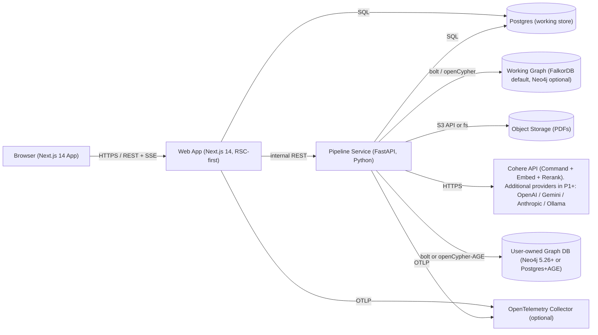

# zkast — Tech Stack

This document captures the technology choices for zkast and the rationale behind each, plus the rejected alternatives. Unlike the other specifications, this one names specific tools because the product's choices around `graphiti-core`, **Cohere** (the P0 LLM provider), Next.js, Neo4j, and Postgres+AGE are explicit product requirements. **`LangExtract`** ships in P0 as a Cohere-backed co-extractor that records character-offset source spans for every entity; Gemini-backed LangExtract is the P1+ upgrade path that delivers higher-fidelity span alignment.

## Architectural Overview

zkast is a two-process system: a TypeScript web tier (Next.js 14) and a Python pipeline service (FastAPI). The Python service exists because the chosen graph framework — `graphiti-core` — and the source-grounding co-extractor — `langextract` — are both Python-only. The split is a deliberate trade-off (see [Why a two-service architecture](#why-a-two-service-architecture) below).

## Frontend

### Framework: Next.js 14 (App Router) with React Server Components

**Choice**: Next.js 14 using the App Router and React Server Components (RSC) first. Client components are kept small and isolated (per project rules).

**Why**:

- RSC-first keeps client bundles small; the working-graph payload can be heavy.
- App Router's streaming and Suspense map well onto our long-running pipeline jobs.
- Vercel deployment is a near-zero-effort P2 SaaS path.
- TypeScript-everywhere reduces drift between API contracts and UI types.

**Rejected**:

- **SvelteKit / Remix**: smaller community for the SaaS deployment story, fewer first-party integrations with Supabase Auth.
- **SPA-only (Vite + React)**: forces all data fetching client-side; loses RSC and SSR caching benefits.

### Styling: TailwindCSS

**Choice**: TailwindCSS for utility-first styling. Component primitives via shadcn/ui (Radix-based).

**Why**:

- Dark-first Obsidian aesthetic is easier with utility classes than with a heavy component library.
- shadcn/ui ships unstyled, accessible primitives we can theme.

**Rejected**: Chakra UI, Mantine — opinionated theming systems fight an Obsidian-style look.

### Graph Visualization: Sigma.js + Graphology

**Choice**: **Sigma.js v3** (WebGL) as the renderer, **Graphology** as the in-memory graph model, **`graphology-layout-forceatlas2`** (Web Worker variant when motion is allowed) for layout, **`graphology-communities-louvain`** for topology-based community detection, and **`graphology-metrics`** for degree / centrality. React integration via **`@react-sigma/core`**. An accessible-list fallback (`Accessible list` toggle) renders the graph as a sortable table for screen readers — see [uiux.md](uiux.md) Graph section.

**Why**:

- Sigma's reducer-based node/edge styling is exactly the right primitive for hover emphasis (dim non-incident nodes), hub-only labels, and density-aware edge alpha — all of which we ship.
- Graphology's ecosystem covers our two graph-data needs in one package family: ForceAtlas2 for layout and **Louvain** for the colour-by-cluster fallback we use when entity types collapse to a single value.
- Sigma handles 5k+ nodes at 60 fps via WebGL (meets NFR-4).

**Rejected**:

- **`react-force-graph` + Cytoscape.js fallback** (prior P0 choice): Sigma's reducer model proved meaningfully simpler for the Sprint 5c hover-emphasis / hub-label / density-edge work than `react-force-graph`'s callback-only API, and a single accessible-list HTML fallback replaced the need for a parallel Cytoscape renderer.
- **D3 from scratch**: too much custom code for layout and gestures.

### State and Data Fetching

**Choice**:

- **TanStack Query** for client-side cache of REST data.
- **Zustand** for ephemeral UI state (current selection, panel layout).
- **SSE (Server-Sent Events)** for streaming job status from the pipeline service through the web tier. The pipeline writes every event to a **Redis Stream** in addition to a pub/sub channel; the SSE endpoint replays the stream (`XRANGE` of the last ~200 entries) on connect so late subscribers see recent history (Sprint 5b).

**Why**:

- TanStack Query handles optimistic updates and background refetch for note editing flows.
- Zustand is small enough to stay out of the way for purely UI state.
- SSE is simpler than WebSockets for our one-way progress stream and survives most proxies; the Redis Stream replay closes the only gap (late subscribers missing history) that pure pub/sub would have.

### Forms and Validation

**Choice**: React Hook Form + Zod schemas (Zod also used to validate API responses for end-to-end safety).

## Backend — Web Tier

### Runtime: Node.js 22 LTS on Next.js Route Handlers

**Choice**: Next.js Route Handlers and Server Actions, running on Node 22 LTS.

**Why**:

- Co-locates the web BFF (backend-for-frontend) with the RSC pages that consume it.
- Server Actions are convenient for mutations called from forms; we still expose a stable REST surface from Route Handlers for the rest of the product.

### Auth

**Choice**:

- **Supabase Auth** in P2 SaaS (email + Google + GitHub).
- **Auth.js (NextAuth)** in P1 self-hosted multi-user, configured with email/password and optional OAuth.
- **Bypass mode** in P0 self-hosted single-user: a synthetic local user with all rights to the default workspace.

**Why**:

- Supabase Auth is operationally trivial in SaaS and integrates with Supabase Postgres RLS.
- Auth.js gives us self-hostable parity without forcing operators onto a SaaS dependency.
- Bypass mode is required for NFR-1 (one-command self-host).

### Validation: Zod schemas shared between client and server

## Backend — Pipeline Service

### Runtime: Python 3.12 + FastAPI

**Choice**: A separate FastAPI service for the ingestion and graph pipeline.

**Why**:

- `graphiti-core` is Python; the official Cohere Python SDK and `langextract` are also Python. Reimplementing any of them in Node is not feasible.
- FastAPI's async model fits our concurrent LLM call patterns and gives us OpenAPI for free, which the web tier consumes as a typed client.
- Python ecosystem advantage for PDF parsing, NLP utilities, and OpenTelemetry instrumentation.

**Rejected**:

- **Running Graphiti via a subprocess shim from Node**: brittle, no native cancellation.
- **Porting just enough of Graphiti to TS**: loses upstream improvements; high maintenance cost.

### PDF Parsing: PyMuPDF (primary) with Unstructured.io optional

**Choice**:

- **PyMuPDF** for default text + page metadata extraction.
- **Unstructured.io** as an opt-in advanced parser for layout-rich PDFs (tables, multi-column).

**Why**:

- PyMuPDF is fast, robust, and AGPL/commercial-friendly via PyMuPDFb.
- Unstructured.io handles complex layouts but is heavier; not required for the typical research PDF.

**Rejected**: `pdfplumber` (slower at scale), `pdfminer.six` (low-level, more error-prone).

### Knowledge-Graph Engine: `graphiti-core`

**Choice**: `graphiti-core` from getzep, acting as the working-graph engine inside the pipeline service.

**Why**:

- Provides the exact primitives we need: episodes (raw chunks), entities, temporal edges, hybrid retrieval, provenance, pluggable drivers.
- Integrates with our chosen LLM provider (Cohere) through its OpenAI-compatible chat endpoint, plus a thin custom embedder and cross-encoder for Cohere's native Embed and Rerank APIs.
- Pluggable graph backends mean we can default to a zero-config option (FalkorDB) for self-hosting while still allowing Neo4j.
- Mature project (25k+ stars, active releases) reduces our "build a graph engine" burden.

**Concurrency (Graphiti × Cohere)**:

- Graphiti schedules parallel LLM, embedding, and rerank work behind a semaphore (`max_coroutines` on `Graphiti`, surfaced internally via `graphiti_core.helpers.semaphore_gather`). The upstream library reads optional env **`SEMAPHORE_LIMIT`** at import time (default **20** in `graphiti_core.helpers`).
- zkast’s **`build_graphiti`** passes an explicit `max_coroutines`: use **`SEMAPHORE_LIMIT`** from the environment when set (integer ≥ 1), otherwise **10** as a **default tuned for typical Cohere rate limits** during large `extract_graph` runs (many episode embeds plus extraction calls). Operators with higher quotas can set **16–20**; if **429** responses persist, try **4–6**. Docker Compose wires **`SEMAPHORE_LIMIT=10`** into **pipeline** and **worker** so self-hosted stacks behave consistently without editing code.

**Working-graph backend (chosen by `graphiti-core`'s driver)**:

- **Default in self-hosted**: **FalkorDB** (single Docker image, Redis-compatible, fast cold start).
- **Optional**: **Neo4j** for users who already run it.
- **Future**: **Kuzu** as an embedded option for the absolute simplest self-host story.

**Rejected**:

- **Custom Neo4j integration without Graphiti**: we would re-implement temporal facts, dedup, and hybrid retrieval.
- **GraphRAG (MS)**: batch-oriented, doesn't fit our incremental, reviewable model.
- **LangChain's graph utilities**: too thin; we'd still need to build the storage layer.

### Entity/Relationship Extraction

**Choice (P0)**: A two-pass extraction pipeline, both backed by Cohere.

1. **Graphiti typed extraction** (primary): each episode (PDF chunk or atomic note) is fed to `graphiti.add_episode(..., entity_types=…, edge_types=…, edge_type_map=…, custom_extraction_instructions=…)`. The entity and edge taxonomies are 10 Pydantic models in `apps/pipeline/app/entity_schemas.py` (`Person`, `Organization`, `Location`, `Document`, `Standard`, `Equipment`, `Process`, `Material`, `Event`, `Concept`) and 8 edge models (`WORKS_FOR`, `LOCATED_IN`, `PUBLISHED`, `CITES`, `MANAGES`, `INSPECTS`, `MITIGATES`, `RELATES_TO`). Each model carries **at least one required field** so the JSON schema Pydantic emits satisfies Cohere's OpenAI-compat `response_format` validator (BUG-010). `EDGE_TYPE_MAP` constrains which edge types are even considered between a given `(subject_type, object_type)` pair to sharpen edge-type precision.
2. **LangExtract co-extractor** (Sprint 5c): runs alongside Graphiti on the same episode body via LangExtract's `OpenAILanguageModel` provider, pointed at Cohere's `https://api.cohere.com/compatibility/v1` endpoint. Returns character-offset spans with verbatim quotes, which we fuzzy-match to Graphiti's typed entities by `(normalized_name, type)` and persist as `entity_evidence` rows. Powers the "View in document" evidence UX. `use_schema_constraints=False` to avoid the same `json_schema` quirk that motivated BUG-010.

**Choice (P1+)**: Switch LangExtract to its native **Gemini** backend (better span alignment and lower cost on long PDFs) once a Gemini provider is configured per workspace. The two-pass shape stays the same.

**Why**:

- Cohere Command supports JSON-mode structured outputs and tool calls via the OpenAI compatibility layer, which is the minimum Graphiti requires.
- Keeping P0 on a single provider (Cohere) eliminates a class of integration risk and matches the user's existing production API key. LangExtract's OpenAI-compat path lets us ship the evidence feature now without taking on Gemini as a P0 dependency.
- LangExtract span grounding is the highest-value provenance affordance in the product — "show me the PDF passage that produced this entity" — and is worth the second Cohere call per episode.

**Rejected**:

- **LLM-only extraction without a framework**: high prompt-engineering surface, brittle structured outputs.
- **spaCy-based NER alone**: misses relationship-level extraction and the rich, typed ontology we need.
- **Deferring LangExtract to P1+** (prior plan): the char-offset evidence is too valuable for the product story and is decoupled enough from the LLM that running it on Cohere in P0 carries low integration risk.

### Async Job Runner

**Choice**: **Arq** (Redis-backed) for async jobs (ingestion, persistence). The same Redis instance backs Arq and is required by FalkorDB, keeping operational surface small.

**Why**: Arq is small, async-native, and integrates with FastAPI's lifespan. Celery is heavier and synchronous-first.

**Per-stage job timeouts**: arq's 300s default is too tight for `extract_graph` once Graphiti starts retrying edge-timestamp extraction. The worker pins per-function timeouts via `arq.worker.func(..., timeout=...)`:

| Stage | Timeout | Rationale |
|---|---|---|
| `parse_document` | 600s | PyMuPDF + chunking; rarely > 30s in practice |
| `generate_atomic_notes` | 1200s | Cohere streaming + fallback non-streaming retry |
| `extract_graph` | 2400s | Per-episode Graphiti loop + edge-timestamp retries |

`_classify_cancel_reason(stage, elapsed_s)` distinguishes `cancelled_by_job_timeout` from `cancelled_by_worker_shutdown` so the operator-facing `failure_reason` is accurate (BUG-006).

**Stage-suffixed dedup keys**: chained `enqueue_job` calls use `_job_id=f"{job_id}:parse"` / `:notes` / `:graph` to avoid arq's silent dedup-skip when the same job_id is reused across stages (BUG-001). The wrapper raises `RuntimeError` if `enqueue_job` returns `None` so any future regression is loud, not silent.

### Pipeline Observability (Sprint 5b)

The streaming pipeline-log drawer is backed by three fan-out channels for every event the worker emits:

1. **Redis pub/sub** (`zkast:jobs:<jobId>`) — drives the live SSE tail.
2. **Redis Stream** (`zkast:jobs:<jobId>:log`, capped at `MAXLEN ~ 1000`) — enables `XRANGE` replay so late SSE subscribers see history.
3. **Postgres `ingestion_run_logs`** — durable post-mortem store; backs `GET .../ingestion-runs/{id}/logs` and the Diagnostics page. Metric events (numeric counters) are intentionally **not** persisted here to keep the table cheap.

`record_log(level, stage, message, data?)` and `record_metric(name, value, stage, data?)` are the two helpers in `apps/pipeline/app/job_redis.py` that every task uses. Job hashes (`zkast:job:<id>`) carry a **7-day NX EXPIRE** so the queue Redis doesn't accumulate forever (TD-006). `POST /admin/cleanup-stale-job-hashes` provides a manual sweep that only touches terminal-status hashes (never live jobs — BUG-005).

**Heartbeat-based reconciler**: each task wraps its work in a `_Heartbeat` async context that writes `ingestion_runs.last_heartbeat_at = now()` every 10s. A worker-side cron (`reconcile_stuck_documents`, fires once per minute via `cron(second=0)`) flips any document whose run is `running` but whose heartbeat is older than 90s to `failed` with reason `worker_crashed_during_<stage>`. Together with explicit `asyncio.CancelledError` handlers in every task (BUG-003), this eliminates the "stuck on Generating Notes" zombie state for good.

### Notes Synthesis Robustness (Sprint 5b/5c)

`apps/pipeline/app/notes_llm.py` calls Cohere's chat completions API with `response_format={"type":"json_object"}`. Two failure modes shipped in P0:

- **Streaming with empty buffer** — Cohere's stream occasionally completes with zero content chunks (BUG-009). On detection, the wrapper transparently retries the same prompt with `stream=False` and emits a `warning`-level log event (`Notes LLM stream returned no content; retrying with stream=False`) into the drawer so the user sees "the system is recovering" rather than "the system is stuck." `pipeline_settings.notes_llm_streaming = false` disables streaming workspace-wide if Cohere's stream becomes chronically unreliable on a given model.
- **Unparseable JSON** — same fallback path; emits an `unparseable_stream` warning.

If both paths produce an empty body the wrapper raises `RuntimeError("Cohere returned an empty notes response; check API key, quota, or model name.")` so the user-facing `failure_reason` is actionable (BUG-008's `_describe_exception` helper guarantees the message is never blank).

### Cohere Transient Retry Helper (Sprint 5b/5c)

`apps/pipeline/app/cohere_adapters._post_json_with_retry` wraps every `CohereEmbedder` and `CohereCrossEncoder` HTTP POST with 3-attempt exponential backoff (1s → 2s → 4s, ±25% jitter). Retries:

- `httpx.ConnectError / ConnectTimeout / ReadTimeout / WriteTimeout / PoolTimeout / RemoteProtocolError`
- HTTP 5xx and 429

4xx other than 429 bubbles immediately (no point retrying a permanent client error). `extract_graph`'s per-episode `asyncio.gather(..., return_exceptions=True)` adds the second resilience layer so one failed episode no longer aborts the whole batch (BUG-008).

### LLM Provider Support

**P0 — single provider, Cohere**:

- **Cohere Command** for chat / atomic-note generation / extraction. Repository defaults: large `command-a-plus-05-2026`, small `command-r7b-12-2024` (overridable per workspace in `pipeline_settings`). Wired into Graphiti through Cohere's OpenAI-compatible endpoint (`https://api.cohere.com/compatibility/v1`) via Graphiti's `OpenAIGenericClient`.
- **Cohere Embed** for embeddings used by Graphiti's hybrid retrieval. Default model `embed-v4.0` (Matryoshka-friendly widths; deployment default embedding dimension **1536** via `EMBEDDING_DIM`). Multilingual or other Cohere embed variants remain selectable per workspace.
- **Cohere Rerank** as the cross-encoder for Graphiti's reranking stage. Default model `rerank-v4.0-fast`. Implemented as a thin custom cross-encoder that wraps Cohere's native Rerank API.
- The user supplies a single **Cohere production API key** at first run; the same key is used for chat, embeddings, and rerank.

**P1+ — additional providers** (deferred, not in P0):

- **OpenAI** (chat + embeddings + reranker via log-prob trick).
- **Google Gemini** (chat + embeddings + reranker), required to unlock the **LangExtract**-grounded extraction stage.
- **Anthropic Claude** (chat).
- **Ollama** (local; chat + embeddings via `OpenAIGenericClient`).
- **Generic OpenAI-compatible** (LM Studio, vLLM, Together, Groq).

Per-workspace settings choose distinct **small** and **large** models so users can use a cheaper model for extraction and a stronger one for note generation. In P0 defaults follow the seeded `pipeline_settings` (Command R7B small, Command A large).

### Why Cohere First

- **The user has a Cohere production API key already**; shipping P0 against a credential they own removes a procurement step.
- **Embed + Rerank in one provider**: most LLM providers cover chat well but rerank poorly. Cohere is the inverse — its Rerank model is widely considered best-in-class and slots directly into Graphiti's cross-encoder interface, materially improving hybrid retrieval quality on day one.
- **Structured outputs are supported**: Default Command-line models support JSON-mode and tool calls via the OpenAI compatibility layer, satisfying Graphiti's structured-output requirement.
- **Single-provider P0 simplifies operations**: one set of credentials, one set of rate limits, one provider's quirks to understand.
- **No lock-in**: the data model (see [datamodel.md](datamodel.md)) treats Cohere as one entry in an `ApiKey.kind` enum that already includes future providers. The pipeline service abstracts the LLM behind an internal interface so adding the next provider in P1 is additive, not structural.

### Grounded Chat (Chat with the Knowledge Graph)

**Choice**: Use **Cohere Chat** with Cohere's native **document-grounding** mechanism. Each user turn flows through:

1. **Retrieval** — Graphiti's `search()` hybrid retrieval (semantic embedding + BM25 keyword + graph traversal) over the workspace's working graph, optionally restricted to a session scope or pinned `GraphSnapshot`. **Cohere Rerank v4** (`rerank-v4.0-fast` by default) re-orders the candidate set; the top-K survivors become grounding documents.
2. **Document assembly** — Each retrieved item (atomic note, entity summary, relationship fact, episode chunk) is rendered into a compact text "document" with stable identifiers. A `RetrievalRecord` is persisted with these documents verbatim before the LLM call.
3. **Generation** — A streaming Cohere Chat call is made with the assembled documents passed via the chat API's documents parameter and grounded mode enabled. The user's question becomes the chat message; prior session messages provide conversation history.
4. **Citation mapping** — Cohere's response contains text spans and per-span citations identifying which documents grounded which spans. The pipeline service translates Cohere's document identifiers back into zkast source ids (note / entity / relationship / episode + optional page range) and persists them as `ChatCitation` rows.
5. **Refusal path** — When retrieval returns fewer than a configurable minimum of usable documents (default: zero), Cohere is called with an instruction-only refusal prompt, returning a short, citation-free refusal stored with status `refused`.

**Why**:

- Cohere's chat-with-documents API is purpose-built for this pattern and removes a large class of citation-format bugs we would otherwise hand-roll.
- We are already paying for Cohere Embed and Rerank; reusing the same provider for chat keeps latency and credentials simple.
- Cohere's citations include the document ids and text spans we need to reconstruct stable, clickable references back to atomic notes and PDF pages.

**Streaming transport**:

- Cohere streams tokens; the pipeline service forwards them to the Next.js web tier over **Server-Sent Events** on the same `GET /jobs/{id}/events` style channel used by ingestion and persistence. A per-message channel emits `token`, `citation`, `retrieval_started`, `retrieval_complete`, `message_complete`, and `message_failed` events.
- Cancellation is a `POST` to the message endpoint; the pipeline service cancels the underlying Cohere stream and writes a `cancelled` status.

**Conversation memory and context limits**:

- The pipeline service truncates conversation history to fit Cohere's input window, preferring most-recent turns. A summary placeholder is inserted for older turns when truncation occurs. Retrieved documents always have priority over history.
- `RetrievalRecord` is the source of truth for what grounded a given message; replaying a question never relies on cached conversation state alone.

**Cost and rate-limit posture**:

- Retrieval is cheap (single Cohere Embed call for the query, single Rerank call over candidates).
- Generation cost scales with retrieved-document size; the pipeline enforces a workspace-configurable per-turn token budget for grounding documents.
- Hot paths share the same Cohere connection pool as ingestion; per-workspace concurrency limits (see [apis.md](apis.md)) protect against rate-limit storms.

**Rejected**:

- **Build our own grounding/citation layer over an ungrounded chat API**: brittle, duplicates what Cohere ships natively.
- **Pass the entire graph to the model and let it pick**: blows past context windows and undermines hybrid retrieval's quality wins.
- **Use Graphiti as the retriever and a different provider for chat in P0**: doubles the credential surface in P0; reconsidered when Gemini/OpenAI providers are added in P1.

## Working Store

### Relational Database: Postgres 16

**Choice**: Postgres 16 for all relational working-store data (users, workspaces, documents, notes metadata, episodes, snapshots, persistence jobs, audit log).

**Why**:

- Industry standard, mature, fits both self-hosted (Docker) and SaaS (Supabase).
- We get `pgvector` for note/entity embeddings if/when we add semantic search inside zkast (the working graph already handles it through Graphiti, but `pgvector` is a useful fallback).
- Supabase compatibility unlocks Row Level Security for the P2 SaaS multi-tenant path.

### Object Storage

**Choice**:

- **Self-hosted**: local filesystem bind-mount inside the pipeline container; optional MinIO if the operator wants S3 semantics.
- **SaaS**: **Supabase Storage** (S3-compatible under the hood).

**Why**: Local filesystem is the simplest possible default; the abstraction in the pipeline service is an S3-compatible interface so swapping in MinIO or Supabase Storage requires only configuration.

### Redis

**Choice**: Redis 7.

**Why**: Already needed for FalkorDB and Arq; doubles as a generic cache for hot reads (e.g., active job status).

## External Persistence Targets

### Neo4j 5.26+

**Choice**: Neo4j Community or Enterprise 5.26+ (matches Graphiti's supported version).

**Why**: De-facto standard for graph databases; users who care about persisting a knowledge graph likely already operate one. Cypher is the most widely-known graph query language.

**Driver**: official `neo4j` Python driver.

### Postgres + Apache AGE

**Choice**: Postgres 16 with the **Apache AGE** extension (openCypher in Postgres).

**Why**:

- Users who already run Postgres can keep their graph in the same database.
- The external-graph contract in [datamodel.md](datamodel.md) is restricted to features both Neo4j Cypher and AGE openCypher support, so the same writer can target either with minimal divergence.

**Driver**: `psycopg[binary]` 3 with AGE-aware query templates.

**Rejected** (for now):

- **Amazon Neptune**: Graphiti supports it, but it's not a common self-host target. Tracked for a later phase.
- **FalkorDB as an external target**: it is already the default working-graph engine; making it also the persistence target collapses the "stage then persist" boundary.

## Observability

### OpenTelemetry

**Choice**: OpenTelemetry SDKs on both the web tier (`@opentelemetry/sdk-node`) and the pipeline service (`opentelemetry-sdk`), exporting via OTLP.

**Why**:

- Graphiti already supports OpenTelemetry tracing; we inherit pipeline-stage spans for free.
- Operators can plug in any OTEL-compatible collector (Tempo, Honeycomb, Datadog, Jaeger).

**Telemetry policy**:

- Disabled by default in self-hosted mode (per NFR-2).
- No third-party analytics in the OSS build. The Graphiti telemetry flag (`GRAPHITI_TELEMETRY_ENABLED`) is forced off.

### Logs

Structured JSON logs from both services, correlated by `trace_id`. Self-hosted operators bind-mount logs out of containers; SaaS ships them to a managed log backend.

## Security

- **Secrets**: All API keys and external-target credentials are encrypted at rest with AES-256-GCM using a per-deployment master key (read from environment / Docker secret). Keys are never returned by any API response.
- **Transport**: HTTPS everywhere in production; the pipeline service is bound to the internal Docker network in self-hosted mode and never exposed publicly.
- **CSRF**: Server Actions and Route Handlers protected by Next.js's built-in CSRF tokens.
- **CORS**: Same-origin only in P0/P1; configurable allowlist in P2 SaaS.
- **Rate limits**: Per-workspace upload and LLM-call rate limits enforced in the pipeline service.

## Deployment

### Self-Hosted (P0/P1)

**Tool**: Docker Compose.

**Containers**:

- `web` — Next.js production build.
- `pipeline` — FastAPI app + Arq worker.
- `postgres` — Postgres 16 (working store).
- `redis` — Redis 7 (Arq + FalkorDB plus cache).
- `falkordb` — Working-graph engine (default).
- `otel-collector` — Optional, off by default.

One `docker compose up` brings the stack up. An `.env.example` lists required variables (`COHERE_API_KEY`, master encryption key) and optional ones (model overrides, base URL overrides for OpenAI-compatible test endpoints).

### SaaS (P2)

- **Web tier**: Vercel (Next.js).
- **Pipeline service**: Fly.io or Render (Docker, multi-region behind a load balancer).
- **Postgres**: Supabase managed.
- **Redis / FalkorDB**: Managed Redis (Upstash) for queue + cache; managed FalkorDB or a dedicated VM for the working graph.
- **Object storage**: Supabase Storage.
- **Auth**: Supabase Auth.
- **Observability**: Managed OTEL backend (operator choice).

## Testing

- **Unit tests**: Vitest on the web tier; `pytest` on the pipeline service.
- **Integration tests**: `pytest` with `testcontainers` for Postgres, Redis, FalkorDB, Neo4j, and AGE. CI runs against both Neo4j and Postgres+AGE for the persistence writer.
- **End-to-end tests**: Playwright running against a Docker Compose stack with a fixture PDF corpus and a recorded LLM provider (using `vcr.py`-style cassettes to avoid live API calls in CI).
- **Linting**: ESLint + Prettier on the web tier; Ruff + Black on the pipeline service.

## CI/CD

- GitHub Actions runs lint, unit, integration, and a smoke E2E on every PR.
- The same CI publishes Docker images on tag pushes.
- SaaS deployments roll out via Vercel for the web tier and a managed pipeline-service deploy on tag promotion.

## Why a Two-Service Architecture

The single most consequential decision is splitting the system into a TypeScript web tier and a Python pipeline service.

**Pros**:

- We get to use `graphiti-core` directly (and `LangExtract` later in P1+), with no porting risk.
- The web team and the pipeline team can iterate independently with clear contracts (OpenAPI).
- The pipeline service can scale and crash without dragging the UI down.
- Each tier uses the ecosystem best suited to its concerns (UI rendering vs. ML/NLP).

**Cons**:

- Two runtimes to operate; slightly more complex Docker Compose.
- API contract drift risk; mitigated by generating a typed client from the FastAPI OpenAPI spec.
- One extra network hop on the critical path; mitigated by SSE for progress and direct DB reads from the web tier for non-pipeline queries.

We accept the cons; without them, zkast either cannot use Graphiti (and later LangExtract), or must build months of bespoke graph infrastructure.

## Versioning and Stability

- The web tier and pipeline service share a major version number.
- The external-graph contract (see [datamodel.md](datamodel.md)) is versioned independently and labeled on persisted graphs (`zkast_schema_version` property). Breaking changes ship a migration writer.

## Related Specifications

- [prd.md](prd.md) — Functional and non-functional requirements driving these choices.
- [datamodel.md](datamodel.md) — Persistent data structure these technologies implement.
- [apis.md](apis.md) — APIs exposed by the web tier and the internal contract to the pipeline service.
- [uiux.md](uiux.md) — UI surfaces rendered by the web tier.
