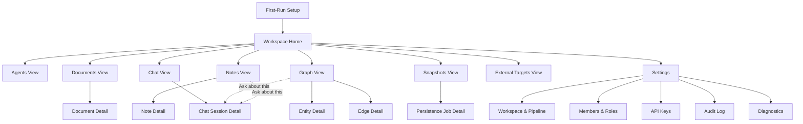
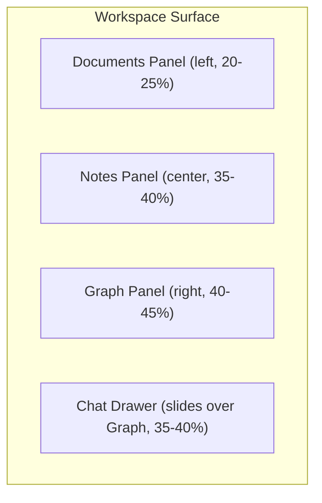
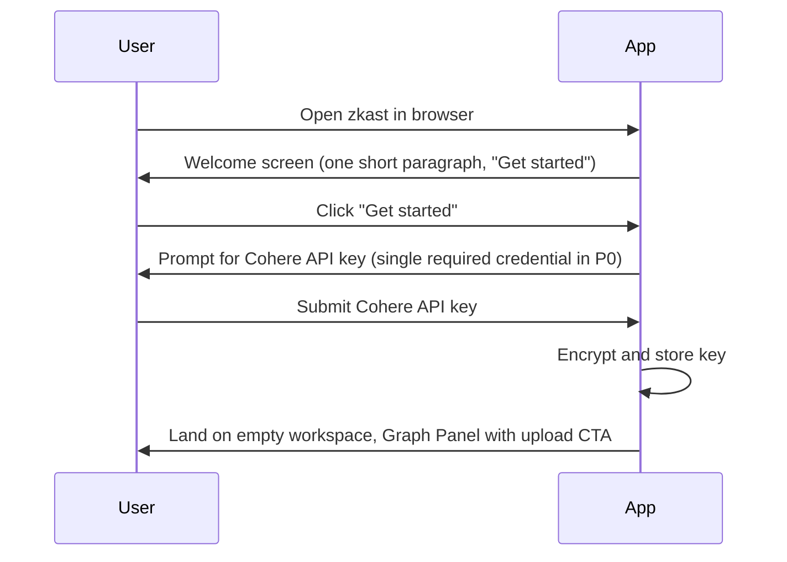
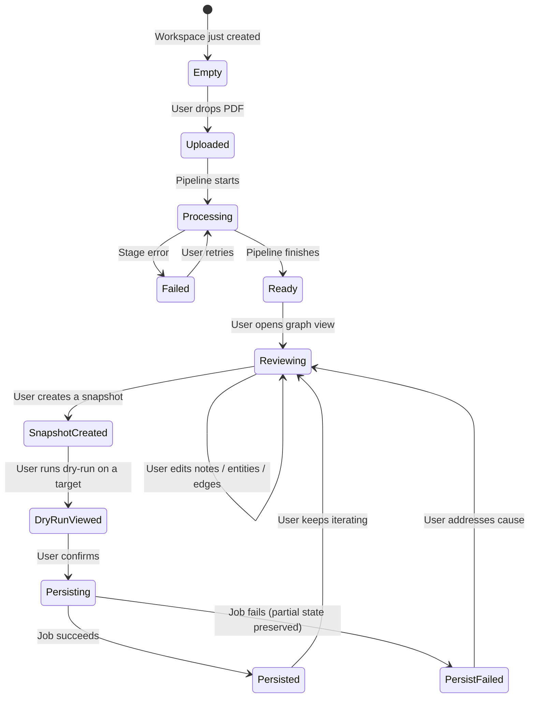
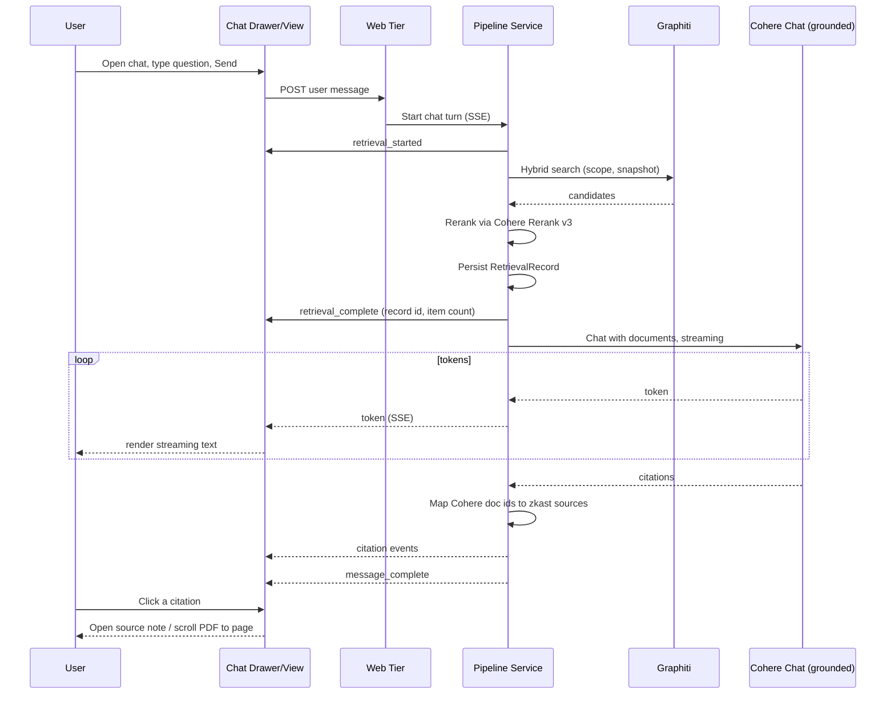

# zkast — UI/UX Specification

This document defines the user interface and interaction requirements for zkast. It describes **what** each surface must do, the states it must support, the flows that connect them, and the design principles that bind it together. No code, no class names, no concrete colors — see [techstack.md](techstack.md) for the chosen tools and [apis.md](apis.md) for the data those surfaces consume.

## Design Principles

- **Review before persistence is sacred.** The graph the user sees in the working view is the only graph; nothing escapes to an external database without an explicit, named act of persistence.
- **Provenance is one click away from every claim.** A user inspecting any entity, edge, atomic note, or chat citation can trace it back to the source document and page in one interaction.
- **Every chat answer must be grounded.** If the workspace's own notes and graph cannot ground an answer, the assistant says so. The product never blends parametric model knowledge with cited workspace facts in a way the user cannot distinguish.
- **The graph is the centerpiece, not a sidebar.** The knowledge graph view occupies the most screen real estate by default. Documents and notes serve it.
- **Long-running operations never block the UI.** Anything that takes more than two seconds runs as a job with a visible, cancellable progress affordance.
- **Dark-first, Obsidian-adjacent aesthetic.** The default theme is dark. A light theme exists for accessibility and printing but is not the marquee experience.
- **Self-host visibility.** Operators always know what the system is doing and where it is sending data; nothing happens behind their back.

## Information Architecture



### Top-Level Navigation

A persistent **left rail** is the primary navigation. Items:

- Documents
- Agents (North sync, conversations, import, dreaming, eval shortcuts)
- Notes
- Graph (default landing inside a workspace after first ingestion)
- Chat
- Snapshots
- External Targets
- Settings
- Audit Log (P1+)

A **workspace switcher** sits at the top of the rail. It shows the current workspace name and offers a menu of accessible workspaces plus "Create workspace" (P1+).

A **global command palette** (keyboard shortcut: `Cmd/Ctrl + K`) is available on every screen, exposing all navigation, document upload, note creation, target test, snapshot creation, and search.

## The Three-Panel Workspace (Primary Surface)

Inside a workspace, the **Workspace surface** uses a three-panel layout with an optional **Chat drawer** that slides in from the right. Panel sizes and drawer state are user-adjustable and persist per user.



Four modes for the layout:

- **Default**: All three panels visible, chat drawer closed. Use case: review and curate.
- **Focus**: One panel maximized, the others as collapsed rails. Use case: deep editing of a single note or graph exploration.
- **Reader**: Documents and Notes panels visible; Graph collapsed. Use case: reading a PDF while reviewing generated notes.
- **Chat-side-by-side**: Chat drawer open; the Graph panel is dimmed and narrowed but remains interactive so the user can watch nodes light up as citations resolve. Use case: asking questions while watching the graph respond. The full-page **Chat View** is the alternative for users who want chat without graph context.

### Layout Rules

- Panels resize via drag handles.
- Each panel has a header with its name, a count badge (documents / notes / entities), and a panel-local search.
- Selection in one panel updates the others (selecting a document filters notes and graph; selecting an entity in the graph highlights its source notes).

## Document Surfaces

### Documents Panel (in Workspace)

**Purpose**: Browse, upload, and triage documents.

**Display elements**:

- A **drop zone** along the top, always visible. Drag-and-drop highlights it.
- A search field (filename substring) and filter chips (Status, Tag — if document-level tags exist).
- A scrollable list of documents. Each row shows: filename, page count, current status with stage timing, ingestion progress bar (if running), a small status icon, and a context menu (re-run, re-ingest with new version, delete).
- An empty state when the workspace has zero documents: a large drop zone, a one-line explanation, and a "Try a sample PDF" link.

**Interactions**:

- Selecting a row filters the Notes and Graph panels to this document.
- Right-click or `…` opens a context menu.
- Multi-select supports bulk delete and bulk re-run.

**States**: empty, loading (skeleton rows), uploading (banner with progress), error (banner with retry).

### Document Detail View

**Purpose**: Inspect a single document's processing history and metadata.

**Display elements**:

- Header: filename, status, total pages, upload date, uploader.
- **Ingestion runs** timeline: every IngestionRun listed with status, started/ended, model used, stats. Each run is expandable to show stage timings and (in self-hosted) the OpenTelemetry trace id with a copy button.
- A "Re-ingest" action with options: from-stage selector and model selector. In P0 the provider selector is fixed to Cohere and the user picks among Cohere chat models; in P1 a full provider switcher becomes available.
- A "Replace with new version" action that takes an upload and reuses the same document slot.
- A "Download" action and a "Preview" action.

**States**: loading, ready, processing (real-time stage updates via SSE), failed (failure stage and reason highlighted).

## Note Surfaces

### Notes Panel (in Workspace)

- Lists atomic notes with search, origin filter, optional document id filter, and **optional North `agent_id` filter** (also deep-linkable via `?agentId=` on the Notes route) so researchers stay inside one agent memory boundary.

**Purpose**: Browse, search, and edit atomic notes.

**Display elements**:

- Search field (full-text over title + body) plus filter chips (tags, document, origin, user-edited).
- Sort selector: recently updated, title, document order.
- List of note cards. Each card shows: title, first line of body, tags (chips), source document indicator (small badge with page number), origin badge (LLM-generated, manual, merged, split).
- Selection highlights the card; selecting a card opens it in the panel itself (single-pane edit) or floats it (split-pane edit), depending on user preference.

**Interactions**:

- Inline edit: clicking the title or body opens an editor in-place; saves are autosaved with a visible indicator.
- Tag chips are editable inline.
- "New note" creates a manual note seeded with current filters (e.g., tags).
- Drag a note onto another to suggest a merge.

**States**: empty (workspace has no notes, with hint to upload), filtered-empty (no notes match), loading, saving, error.

### Note Detail View

**Purpose**: Full edit and link surface for a single note.

**Display elements**:

- Editable title, tags, and body. Body editor supports Markdown with inline preview, image and link rendering, and `[[wikilink]]` syntax that resolves to other note titles.
- **Agent memory (A-MEM / dreaming)**: when present, read-only summary of `memory_context`, keyword chips, last dreaming touch timestamp, and a concise indicator that evolution history exists (expandable in future).
- **Links section**: inbound and outbound links, each with kind (related, supports, refutes, extends, references, custom) plus **link reason** text when supplied by generation or dreaming. Each link is clickable and shows the target's title and tags.
- **Source section**: source episodes with their page references and a "View in PDF" action that scrolls the document preview to the matching page.
- **Graph mini-map**: a small visualization of this note's local entity neighborhood (the entities mentioned in the note and their direct connections).
- Actions: merge with…, split, delete, mark reviewed, **Ask about this**.

**States**: viewing, editing, conflict (a concurrent edit detected — surfaced with a non-destructive merge prompt).

## Graph Surface (Primary)

The graph view is the centerpiece. It exists as both the **Graph Panel** (in the three-panel layout) and a full-screen **Graph View** route.

### Display Elements

- **Canvas**: WebGL-rendered force-directed graph (Sigma.js v3 + Graphology + ForceAtlas2 Web Worker) filling the available space. Pan (drag), zoom (wheel/pinch), select (click), multi-select (shift-click or marquee). A subtle radial gradient background (`#0b1224 → #020617`) gives the canvas depth.
- **Cluster legend** (bottom-left, sticky): one row per visible entity type or community with a colored swatch, label, and count. The legend auto-switches between two modes (Sprint 5c):
  - **Type mode** (default when the graph contains ≥ 2 distinct entity types): each row is an entity type from the Pydantic taxonomy (`Person`, `Organization`, `Standard`, `Equipment`, …).
  - **Cluster mode** (fallback when typed extraction collapses to a single value): Louvain community detection partitions the graph by topology and assigns each community a distinct hue. Each row is labelled with the highest-degree node in that community as a human-readable hint (e.g., "Reactor Coolant System Materials Degradation"), not "Cluster 3".
- **Zoom controls** (top-right, sticky): three buttons — zoom in, zoom out, reset view — animated 200–250 ms via Sigma's `animatedZoom` / `animatedUnzoom` / `animatedReset`.
- **Filter bar** (top): four searchable pickers replace the prior free-form chip inputs (Sprint 5c) — see [Graph Filter Bar](#graph-filter-bar) below.
- **Time slider** (optional): a horizontal slider showing relationships' validity windows. Dragging it moves "now" backward or forward and re-renders only edges valid at that instant.
- **Search bar**: hybrid semantic+keyword search that animates the viewport to the top result and highlights it.
- **Selection panel** (right edge, slides in): properties of the selected node or edge, full provenance (source notes and documents), the **Evidence** section (Sprint 5c — see [Entity Selection Panel](#entity-selection-panel)), incident relationships, and inline actions (rename, merge with full undo, edit edge, mark reviewed).
- **Status footer**: node count, edge count, current filter summary, frame rate (in dev/debug mode).

### Visual Encoding (Sprint 5c)

- **Node color**: from the legend mode (type palette or Louvain community palette). 12 perceptually-distinct hues from the Tailwind 400 stop.
- **Node size**: scales by degree — `clamp(2.5, 2.5 + √degree × scale, 20)` — so hubs are visually prominent and leaves shrink out of the way. Outlines are 0.5 px `#020617` so colored fills retain their edge against the canvas background.
- **Hub-only labels at base zoom**: only the top ~12% of nodes by degree show their label at default zoom (capped between 12 and 40 labels). Full labels for the rest are stored in a `fullLabel` shadow attribute and revealed on hover or as the user zooms in. Eliminates the "text salad" problem on dense 200+ node graphs.
- **Density-aware edge alpha**: an edge's transparency scales with the minimum degree of its endpoints. Periphery-periphery edges paint at ~55% alpha (clearly visible); hub-hub edges fade to ~12% so cluster cores don't paint a solid mat. Edge color is a slate stroke (`rgba(148, 163, 184, α)`); edge labels are off at base zoom and surface on hover.
- **Hover emphasis**: on `enterNode`, all non-incident nodes/edges dim to ~15% alpha; the hovered node + its 1-hop neighborhood stays at full saturation; incident edges flash accent teal (`rgba(20, 184, 166, 0.85)`); the hovered subgraph's labels are forced on regardless of zoom. Implemented via Sigma's node/edge reducers with a pre-computed neighbor `Set` for O(1) per-frame cost.
- **Initial layout**: nodes are seeded onto per-community concentric rings around a central wheel before ForceAtlas2 runs. Settings: `linLogMode`, `adjustSizes`, `gravity 0.08`, `scalingRatio 20`, `barnesHutOptimize`. Runs up to 8 seconds for graphs up to 3000 nodes; reduced-motion users get a synchronous, non-animated pass.

### Graph Filter Bar

> Sprint 5c — implemented. The four free-form UUID/CSV inputs from earlier sprints are replaced by ARIA-compliant pickers that load from real data. Underlying query-string contract is preserved (`document_id`, `tag`, `entity_types`, `edge_types`, `seed_entity_ids` — comma-separated CSV).

- **View** — single-select dropdown: `Overview` | `Subgraph`.
- **Seed entities (subgraph)** — `EntityTypeahead` multi-select. Type → debounced search via `GET /workspaces/{ws}/graph/entities/search-typeahead?q=`. Selected items render as chips showing name + type; the underlying value is a comma-separated UUID list. Backspace on an empty input removes the last chip. A metadata cache lets deep-linked chips render with name + type even on a fresh page load.
- **Document** — `DocumentPicker` combobox over the workspace's ready documents (filename + page count). One selection; clearable.
- **Tag** — `TagPicker` combobox over distinct `atomic_notes.tags`. Free-text fallback so the user can type a tag not yet in the vocabulary (useful when filtering before ingestion completes).
- **Entity types** — `TypeMultiselect` chip group; options come from `GET /workspaces/{ws}/graph/types` with their counts shown beside each chip.
- **Edge types** — same component, `kind="edge_types"`.

All four components follow the ARIA combobox pattern (text input + listbox + selected-options region) with keyboard nav (↑/↓/Enter/Esc). Chips have visible focus rings. A "Clean orphan rows" affordance lives to the right of the bar; it confirms via the `useConfirm` provider and reports results via `useToast`.

### Interactions

- **Single-click** a node: select and open the selection panel.
- **Double-click** a node: focus the graph on its neighborhood (zoom + soft-fade the rest).
- **Right-click** a node: context menu (rename, merge with…, delete, view source notes, expand neighbors, **Ask about this**).
- **Hover** a node: hover-emphasis effect described above plus a tooltip with name, type, summary first sentence.
- **Drag** a node: temporarily pin it; click empty space to release.
- **Drag** between two nodes (modifier key held): start a "Connect" interaction; pick an edge type from a flyout.
- **Marquee selection**: select multiple nodes; bulk actions appear (merge cluster, set type, tag, delete).
- **Keyboard**: arrow keys to walk between connected nodes; `/` focuses search; `?` shows shortcuts.

### Entity Selection Panel

The selection panel that slides in from the right contains, in order:

- **Header**: entity name + type badge, edited indicator, close button.
- **Summary**: LLM-maintained one-paragraph description.
- **Aliases**: if any.
- **Evidence** (Sprint 5c): up to 10 `entity_evidence` rows. Each row shows the document filename + page number, a blockquote of the verbatim PDF passage that produced the entity, and a "View in document" link that navigates to `/documents/<id>?page=N&highlight=<offset>`. A "N more evidence rows" affordance pages the rest in. Empty state guides the user to re-ingest with LangExtract enabled if the entity predates Sprint 5c.
- **Source notes** and **Source documents / pages**: the looser provenance lists (note titles and document/page refs).
- **Neighbors**: 1-hop neighborhood summary with type chips.
- **Relationships popover** (`GraphEdgePopover`): list incident edges, create new manual edges, edit edge `type` / `fact` / `valid_from`, or end a relationship by setting `valid_to`.
- **Footer actions**: "Merge with another entity…" opens the merge dialog (see [Merge Flow with Persisted Undo](#merge-flow-with-persisted-undo)).

### Accessibility Mode for the Graph

Because force-directed WebGL is hard to make accessible, the Graph Surface ships an **Accessible Graph View** toggle that renders the same data in a structured form:

- A focusable list of entities (paginated, sortable, filterable).
- For the selected entity: a focusable list of incident edges with target entity, edge type, and provenance.
- All actions available in the canvas are available here via keyboard.
- Screen readers announce selection changes and counts.

### States

- **Empty**: workspace has no entities yet. Show a friendly illustration and a "Upload your first document" call-to-action.
- **Computing layout**: skeleton + a non-blocking spinner while the WebGL layout settles.
- **Truncated**: when the node limit is exceeded, a banner explains and offers "Add filter" or "Increase limit."
- **Stale**: when an ingestion is in flight, a soft pulse and a "Working graph is updating" indicator.
- **Error**: render fails or data fails to load — render the Accessible Graph View as a fallback.

## Chat Surface

The chat surface lets the user ask natural-language questions of the workspace's knowledge graph. It exists in three forms:

- **Chat Drawer** in the Workspace surface — a slide-in pane from the right edge that overlays/narrows the Graph Panel.
- **Chat View** — a full-page route showing one session in focus mode.
- **Chat Home** — a list of sessions in the workspace.

### Chat Home

**Purpose**: Browse, search, and resume chat sessions.

**Display elements**:

- Top: a single, prominent **"New chat"** action and a search field over session titles and last messages.
- Filter chips: My sessions, Shared (P1+), Pinned snapshot, Has open questions (sessions with an in-flight assistant turn).
- List of session cards, sorted by recent activity. Each card shows: title, last user/assistant message preview, scope summary chips (documents/tags/types/snapshot), member avatars (shared sessions only), last-activity timestamp.
- Empty state: a one-screen "Ask your knowledge graph" call-to-action with three example prompts seeded from the current workspace's tags and document titles.

**Interactions**:

- Click a session card to open Chat View.
- Hover a card to reveal "Rename," "Pin to snapshot," "Delete," and (P1+) "Share."

### Chat View / Chat Drawer (shared anatomy)

**Display elements**:

- **Header**: session title (editable inline), scope chips, model badge, snapshot pin indicator (if any), **retrieval strategy** selector (Naive RAG / raw transcript alias, GraphRAG, Hybrid, Zettel note vectors, A-MEM lite vectors — locked after first message), a session menu (rename, change scope, pin/unpin snapshot, share, export, delete).
- **Transcript**: scrollable history of message bubbles.
  - **User messages**: right-aligned, plain text, with timestamp on hover.
  - **Assistant messages**: left-aligned, support markdown rendering, with citation markers inline (see below), a footer row showing citation count, coverage percentage, latency, and a context menu (regenerate, show retrieved context, copy, report bad answer).
  - **Refusal messages**: visually distinct (muted color, info icon, no citations), with a "Suggested next step" affordance.
  - **Streaming messages**: a soft caret follows the leading edge of the streamed text; partial citations resolve into final chips as their cited spans complete.
- **Composer** at the bottom: multi-line text input, scope chip selector, Send button. While a response is streaming, Send is replaced by a **Stop** button.
- **Retrieval inspector** (slide-out from the right of the transcript): when "Show retrieved context" is opened on an assistant message, this panel lists the retrieved items with their scores, kinds (note / entity / relationship / episode), and excerpts. Each item is clickable and opens its native view.
- **Alternates strip** (under any assistant turn with multiple alternates): a small horizontal control "1 / 3" with prev/next, plus a "Set as answer" button.

**Citation rendering**:

- Each citation is shown as an inline superscript chip (e.g., a small numbered pill). Hovering shows the source(s); clicking the chip resolves to the primary source (preferred order: atomic note > document page > entity > relationship > episode).
- A citation can reference multiple sources; the hover popover lists all of them grouped by kind.
- A citation whose primary source has since been deleted from the graph still renders, but with a "Source no longer in graph" indicator and a tooltip showing the persisted excerpt.
- The footer of each assistant message shows a small "Coverage" meter (`% of message text that is cited`). Below a configurable threshold (default 50%), the meter is colored to draw attention.

**Interactions**:

- Submit a question with `Enter`; `Shift+Enter` inserts a newline.
- `Esc` while streaming triggers Stop.
- Clicking a citation:
  - in the Chat Drawer, opens the source in the appropriate workspace panel (note in Notes panel, entity selection in Graph panel, document preview scrolled to page).
  - in the Chat View, opens an inline source preview side-pane (the user is on a chat-focused page and may not want to navigate away).
- "Ask about this" entry points from the Graph and Notes views open the Chat Drawer with a pre-scoped session and a pre-filled prompt.

**States**:

- **Empty session**: composer focused; the empty transcript shows three example prompts based on the current scope (e.g., for a session pinned to one document, the examples mention that document).
- **Retrieving**: a subtle banner "Searching your knowledge graph…" appears above the streaming bubble until the `retrieval_complete` event arrives. Then the bubble starts filling with tokens.
- **Streaming**: caret-following animation; Stop button visible.
- **Complete**: final citations resolved; coverage meter and footer actions visible.
- **Cancelled**: partial text retained with a "Cancelled" tag; Regenerate offered.
- **Refused**: distinct refusal style with "Suggested next step" affordance.
- **Failed**: error banner inside the message bubble; Retry offered; underlying trace id surfaced in self-hosted mode.
- **Stale-source**: an assistant message whose retrieved items have since changed in the working graph shows a small "Knowledge graph has changed since this answer" hint with a Regenerate shortcut.

### Accessibility for Chat

- Each assistant message is rendered as a single ARIA `article` with a meaningful label. Streaming updates use ARIA live regions with `aria-live="polite"`.
- Citation chips are focusable links with descriptive `aria-label`s (e.g., "Citation 3 of 5, sources: note 'Limits of bottom-up analysis', document 'Smith 2024' page 12").
- The retrieval inspector and alternates strip are fully keyboard navigable.
- The chat composer supports screen reader announcements for streaming progress and message completion (e.g., "Answer complete, 5 citations").

## Snapshot Surfaces

### Snapshots View

**Purpose**: List, review, and act on snapshots.

**Display elements**:

- List of snapshots with name, date, creator, stats (entities, edges, notes), review state badge (`none` | `approved` | `rejected` | `needs_changes`), and any active persistence jobs. The `needs_changes` badge is a soft block — distinct from `rejected` — and signals that the reviewer wants edits before approval. See [datamodel.md](datamodel.md) `SnapshotReview`.
- Action: "Create snapshot from current graph" prominently at the top, opens a modal asking for name and optional description.
- Action per snapshot: View, Review, Persist, Delete.

### Snapshot Detail View

**Purpose**: Inspect a specific snapshot.

**Display elements**:

- Header with name, description, stats, creator, created_at.
- "Review" panel: three-state decision (`Approve` / `Reject` / `Needs changes`) with optional rationale (≤ 2000 chars); shows existing reviews and history. Re-submitting overwrites the per-reviewer row (single-row-per-reviewer-per-snapshot). Persistence is gated on an `approved` decision per workspace settings; `needs_changes` is treated the same as no decision for gating purposes.
- "Persist" panel: target selector, write mode (`upsert` default, `replace` requires confirmation), include-provenance toggle, "Dry run" button.
- **Dry-run result**: counts of nodes/edges that will be added, updated, deleted; a sampled preview of each category; `replace` mode is locked until a dry run has been viewed.
- Persistence job history for this snapshot.

## External Targets Surface

**Purpose**: Manage where snapshots get persisted.

**Display elements**:

- List of targets with kind, name, host, last test status, last used.
- "Add target" opens a guided flow:
  - Step 1: pick `Neo4j` or `Postgres + Apache AGE`.
  - Step 2: enter host/port/database/graph name and credentials. The form clearly says secrets are encrypted at rest.
  - Step 3: "Test connection" runs the test endpoint; required permissions are listed and the report shows which are present.
  - Step 4: Set default write mode; save.
- Each target has: "Test now," "Edit," "Delete," and "View persistence history."

**States**: empty (no targets configured — explain why a target is needed and link to docs), testing, ok, failing (banner with last error).

## Settings Surfaces

### North integration (Settings)

- **North API base URL** field with validation (must be empty or `http(s)` URL), saved via pipeline settings PATCH. Never stores bearer tokens in JSON.
- **North bearer token** captured only through the API Keys flow as kind `north_bearer` (masked after save, rotate/remove like other keys).
- **Test North** action calls the connectivity probe and surfaces success (`agent_count`) or structured failure (misconfiguration vs upstream).
- **Configured state**: show whether URL + token are present without revealing secrets; link to Agents when North is incomplete.

### Workspace Settings

- Name, slug, description (editable).
- Pipeline parameters: chunk size, max notes per document, language, LLM provider (P0: Cohere only, selector disabled with explanatory copy; P1: full selector), small chat model, large chat model, embedding model, rerank model, include-provenance-subgraph default.
- Telemetry toggle (off by default in self-hosted).
- Danger zone: delete workspace (requires typing the slug).

### Members & Roles (P1+)

- Members list with role badges.
- Invite by email with role selector.
- Re-role and remove actions.
- Pending invites with expiry and a copy-link action.
- The UI prevents removing the last Owner with a clear explanation.

### API Keys

- List with kind, label, last used.
- Add (modal with secret input that masks after first save).
- Rotate (modal — confirms in-flight jobs continue with the old key).
- Delete (blocked if in use by an active target; UI explains how to clear that dependency).

### Audit Log (P1+)

- Date range, actor, action, target filters.
- Table view with timestamp, actor, action, subject, brief metadata.
- Each row expandable to show structured metadata (with secrets redacted).
- Export to CSV.

### Diagnostics (Sprint 5b)

> Owner-only. Route: `/settings/diagnostics`. Powered by `GET /admin/diagnostics`.

A live operations dashboard surfacing the health of the ingestion pipeline so a self-hosted operator can answer "is anything stuck?" without `docker compose exec`.

**Display elements**:

- **Queue panel**: current arq queue depth, in-progress job IDs, and per-stage job counts.
- **Stalled documents panel**: documents in an active status whose `ingestion_runs.last_heartbeat_at` is older than `HEARTBEAT_STALE_THRESHOLD_S` (~90 s). Each row links to the document detail and shows the run id + last seen at.
- **Per-stage latency**: p50 / p95 for `parsing` / `generating_notes` / `extracting_graph` over the last 100 runs, computed from `ingestion_run_logs`.
- **Hash hygiene**: total `zkast:job:*` Redis hashes, count in terminal status (`succeeded` / `failed` / `cancelled`), and a `Cleanup stale hashes` action that confirms via `useConfirm` and reports results via `useToast`. Never touches live jobs.
- **Polling**: 5-second client-side refresh while the page is open.

## Onboarding and First-Run Flows

### Single-User Self-Hosted (P0)



The first-run flow never asks the user to create an account, configure SMTP, or set up auth.

### Multi-User Self-Hosted (P1)

```mermaid
sequenceDiagram
    participant Op as Operator
    participant App
    participant User
    Op->>App: First boot, sees admin setup screen
    Op->>App: Create initial Owner account (email + password)
    Op->>App: Confirm encryption master key is set
    App->>Op: Sign in as Owner; default workspace exists
    Op->>App: Invite teammates
    User->>App: Open invite link, set password
    App->>User: Land on the invited workspace
```

### SaaS (P2)

- Sign-up via email or SSO.
- A first workspace is created automatically.
- Onboarding checklist: connect Cohere credentials (or use the SaaS-provided pool), upload first PDF, create first snapshot, configure first external target. (Additional provider options appear once P1 lands.)

## Core Interaction Flows

### Flow: Upload -> Process -> Review -> Persist



Each transition has a clear UI signal:

- **Uploaded -> Processing**: row gains a progress bar; the workspace gets a "Processing" badge in the rail.
- **Processing -> Ready**: a non-intrusive toast; the document row turns into a green-check state; the Graph Panel reflects new entities.
- **Reviewing -> SnapshotCreated**: a modal confirms the snapshot's name; the Snapshots view counter increments.
- **DryRunViewed -> Persisting**: a confirmation dialog summarizes the diff; `replace` mode requires re-typing the target name.
- **Persisting -> Persisted**: the Persistence Job Detail view shows green; an in-app notification with a deep link.

### Flow: Re-Ingest an Updated Document

1. From the document row, the user picks "Replace with new version."
2. The user selects a new file. The app shows: number of notes derived only from the old version, number of entities and edges that will potentially be re-extracted.
3. The user confirms. A new IngestionRun starts; the Graph Panel marks the document's nodes as "updating."
4. On completion, the user is offered "Compare with last snapshot" if a prior snapshot exists.

### Flow: Diagnose and Retry a Failed Document

1. A failed document is visually obvious (red icon, error text).
2. Clicking the row opens Document Detail with the failing stage highlighted.
3. The user clicks "Retry from <stage>" — defaulting to the failing stage, not the beginning.
4. If the failure was rate-limiting, the UI offers "Retry with exponential backoff."

### Flow: Ask the Knowledge Graph a Grounded Question



When retrieval yields no usable context, Pipe skips the Cohere generation call and streams a refusal message instead (status `refused`).

### Flow: Merge Two Entities

1. In the Graph view, the user multi-selects two entities (shift-click).
2. A floating action bar offers "Merge."
3. A modal lists the two entities side-by-side with their canonical name, aliases, summary, and properties.
4. The user picks the survivor and chooses field-by-field whose values to keep.
5. Confirm. A toast offers Undo for the next 30 seconds.
6. The Graph Panel animates the merge (the two nodes pulse, edges re-route).

## States Reference (Per View)

Every primary view supports these states explicitly:

- **Empty**: nothing to show — friendly illustration, one-sentence explanation, one CTA.
- **Loading**: skeleton placeholders matching the final layout.
- **Filtered-empty**: filter active but nothing matches — explain and offer "Clear filters."
- **Error**: a non-blocking banner with what failed and a "Retry" action; the rest of the UI remains usable when possible.
- **Processing**: a clearly-labeled indicator that work is in progress, with a way to inspect (open the job).
- **Stale**: a soft hint that the data shown was loaded earlier and may not reflect newer changes; a one-click refresh.

## Visual Design System

The visual direction below is **prescriptive at the token level** (specific hex values, font families, breakpoints) and **descriptive at the application level** (how components combine). It is the source of truth a design pass refines, not replaces.

The chosen aesthetic identity is **Dark Mode (OLED) + Editorial / Academic**, balancing the workspace's dense data surfaces (Obsidian-style graph, three-panel layout) with the long-form reading the Zettelkasten note view demands. Reference style targets: WCAG **AAA**-friendly color contrast, low chromatic noise, surface elevation through value rather than color.

### Design Tokens — Color

**Dark theme (default, marquee experience)**:

| Token                       | Hex       | Use                                                          |
| --------------------------- | --------- | ------------------------------------------------------------ |
| `bg-canvas`                 | `#020617` | Page background (deep slate-950)                             |
| `bg-surface`                | `#0F172A` | Panels and cards (slate-900)                                 |
| `bg-surface-raised`         | `#1E293B` | Hovered/selected surfaces (slate-800)                        |
| `bg-surface-overlay`        | `#0F172AE6` | Drawer / modal overlay (slate-900 @ 90%)                    |
| `border-subtle`             | `#1E293B` | Default 1px borders                                          |
| `border-strong`             | `#334155` | Focus borders, separators that must be visible               |
| `text-primary`              | `#F8FAFC` | Body and titles (slate-50)                                   |
| `text-secondary`            | `#CBD5E1` | Captions, metadata (slate-300)                               |
| `text-muted`                | `#94A3B8` | Hints, placeholders (slate-400; ≥ 4.5:1 on `bg-canvas`)      |
| `accent-primary`            | `#14B8A6` | Brand accent (teal-500) — selection, primary action, cohere-aligned |
| `accent-primary-hover`      | `#2DD4BF` | Hover state of accent                                        |
| `accent-secondary`          | `#A78BFA` | Secondary accent (violet-400) — links and citation chips     |
| `success`                   | `#22C55E` | Job success, ready states                                    |
| `warning`                   | `#F59E0B` | Stale-source, partial-persist warnings                       |
| `danger`                    | `#EF4444` | Failed jobs, destructive actions                             |
| `info`                      | `#38BDF8` | Streaming / processing indicators                            |

**Light theme (accessibility, printing, and operator preference)**: same role mapping with values inverted on the slate ramp (`bg-canvas: #F8FAFC`, `bg-surface: #FFFFFF`, `bg-surface-raised: #F1F5F9`, `text-primary: #0F172A`, `text-secondary: #475569`, `text-muted: #64748B`). Borders use `#E2E8F0` (subtle) and `#CBD5E1` (strong). Accents are darkened one step (`teal-600 #0D9488`, `violet-600 #7C3AED`) to maintain 4.5:1 on white.

**Graph entity-type palette** (categorical, type-tied subtle hues — colorblind-safe with shape backup):

| Entity Type   | Dark hex  | Light hex | Shape marker |
| ------------- | --------- | --------- | ------------ |
| Person        | `#60A5FA` | `#2563EB` | Circle       |
| Organization  | `#A78BFA` | `#7C3AED` | Hexagon      |
| Concept       | `#14B8A6` | `#0D9488` | Diamond      |
| Location      | `#F59E0B` | `#B45309` | Triangle     |
| Work          | `#F472B6` | `#BE185D` | Square       |
| Date          | `#94A3B8` | `#475569` | Pill         |
| Event         | `#FB923C` | `#C2410C` | Star         |
| Custom        | `#22D3EE` | `#0E7490` | Outline ring |

Edges use `#64748B` at 50% opacity in dark mode and `#94A3B8` at 65% opacity in light mode. Selected edges use `accent-primary` at full opacity. Edge type is encoded by dash pattern (solid for asserted, dashed for inferred, dotted for ended/`valid_to` set).

### Design Tokens — Typography

Three-family system, chosen for both UI clarity and long-form note legibility:

| Role            | Family                | Use                                                           |
| --------------- | --------------------- | ------------------------------------------------------------- |
| UI sans         | Plus Jakarta Sans     | All UI chrome: nav, panel headers, buttons, table rows, chat composer |
| Reading serif   | Crimson Pro           | Atomic note titles and body, snapshot descriptions, document detail copy |
| Mono            | JetBrains Mono        | Identifiers, edge facts, code blocks in markdown, audit-log metadata |
| Accessible body (opt-in) | Atkinson Hyperlegible | User-selectable substitute for the reading serif, designed for low-vision readers |

**Type scale** (modular, ratio ≈ 1.2):

- `display`: 30px / 600 / -0.02em — used only on empty-state hero copy and onboarding
- `title-1`: 24px / 600 / -0.01em — view titles
- `title-2`: 20px / 600 — panel headers, modal titles
- `title-3`: 16px / 600 — card titles, settings group titles
- `body`: 14px / 400 / line-height 1.5 — UI default
- `body-lg`: 16px / 400 / line-height 1.65 — reading-serif note bodies
- `caption`: 12px / 400 — metadata, helper text
- `mono`: 13px / 400 / line-height 1.5 — identifiers and code

Note bodies in `body-lg` Crimson Pro receive `max-width: 68ch` to preserve reading line length.

### Design Tokens — Spacing, Radius, Elevation

- **Spacing scale**: 4 / 8 / 12 / 16 / 20 / 24 / 32 / 40 / 48 / 64 px. Component-internal padding starts at 8, container padding at 16+.
- **Radius**: `radius-sm` 6px (chips, tags), `radius-md` 8px (buttons, inputs), `radius-lg` 12px (cards, modals), `radius-full` 9999px (avatars, pill buttons).
- **Elevation (dark mode)**: surface elevation comes from value, not shadow. Order: `bg-canvas` < `bg-surface` < `bg-surface-raised`. Drop shadows are reserved for modals/popovers and use `box-shadow: 0 8px 24px rgba(2, 6, 23, 0.6)`.
- **Elevation (light mode)**: shadows allowed; `shadow-sm` for hover, `shadow-md` for popovers, `shadow-xl` for modals. Borders carry more weight in light mode than in dark.

### Design Tokens — Motion

Motion is meaningful, never decorative. **At most one hero animation per view**; everything else is subtle state feedback.

| Use                       | Duration | Easing                          |
| ------------------------- | -------- | ------------------------------- |
| Hover / selection         | 150ms    | `ease-out`                      |
| Panel open                | 200ms    | `ease-out` (entering)           |
| Panel close               | 180ms    | `ease-in` (exiting)             |
| Modal/drawer open         | 220ms    | `cubic-bezier(0.16, 1, 0.3, 1)` (spring-like ease-out) |
| Streaming-token caret     | 800ms loop | `ease-in-out`                 |
| Graph node entry          | 300ms    | `ease-out`                      |
| Toast in/out              | 180ms    | `ease-out` / `ease-in`          |
| Page transitions          | 200ms    | `ease-out`                      |

**All motion respects `prefers-reduced-motion: reduce`**: durations collapse to 0ms for transforms; only color/opacity transitions remain. The graph view's physics simulation has a corresponding "Static layout" toggle.

### Iconography

- **Library**: a single SVG icon set throughout — **Lucide** (primary) with **Heroicons** as the fallback for any glyph Lucide lacks.
- **No emojis are used as UI icons**, ever. Emojis may appear in user-authored note content (escaped, not as glyphs the product itself emits).
- **Sizes**: `icon-sm` 16px (rails, inline citation chips), `icon-md` 20px (buttons, list rows), `icon-lg` 24px (page headers, empty states).
- **Stroke**: 1.5px outline style, consistent across the set. Filled variants only for active/selected toggle states.
- **Brand logos** (in onboarding, target-pick screens for Neo4j / Postgres+AGE / Cohere): pulled from each project's official SVG; never redrawn or approximated.

### Interaction Affordances (Common Rules, Non-Negotiable)

- Every clickable / hoverable element has `cursor: pointer`.
- Every interactive element has a visible hover state achieved via **color or opacity change**, never via transform-scale (which causes layout shift and breaks neighbor alignment).
- Every interactive element has a visible **focus ring** (2px solid `accent-primary` with a 2px offset against `bg-canvas`).
- Long text in cards, table cells, and rails uses `truncate` (1 line) or `line-clamp-2` (2 lines); overflow never breaks layout.
- Disabled controls drop to `opacity: 0.45` with `cursor: not-allowed`; never via low-contrast text alone.

### Density Modes

- **Comfortable** (default): row heights 40–48px, panel padding 16px, body 14px.
- **Compact** (power-user toggle): row heights 28–32px, panel padding 8–12px, body 13px. Compact mode does not reduce hit-target size below 32×32px for touch.

### Anti-Patterns to Avoid

- **No emoji icons**. Use SVGs from the chosen icon set.
- **No hover-scale transforms** that shift neighbors. Use color/opacity instead.
- **No mid-gray text** (`#94A3B8` or lighter) on `bg-canvas` for primary content. Reserve `text-muted` for helper text only.
- **No invisible borders in light mode** (`border-white/10` equivalents are dark-mode only; light mode uses `#E2E8F0` minimum).
- **No glass surfaces below 70% opacity** in light mode (transparent panels become unreadable on white).
- **No animation-everywhere**: maximum one hero animation per view; the rest is utility-grade state feedback.
- **No nav-stuck-to-top-zero**: the floating left rail keeps 16px of breathing room from the viewport edge.
- **No mystery clickability**: every clickable surface must respond to hover.
- **No reliance on color alone** in the graph: entity types are also encoded by shape; selection is encoded by halo, not just color.

### Source

This system was generated by the `ui-ux-pro-max` skill cross-referenced with zkast's product requirements. The chosen pattern (Dark Mode OLED, WCAG AAA color rails), typography (Plus Jakarta Sans + Crimson Pro + JetBrains Mono — UI + Academic Reading hybrid), and network-graph guidance (categorical type colors, edges at low opacity, accessibility fallback) are direct inputs from the skill's recommendations.

## Accessibility

zkast targets **WCAG 2.1 AA** across all surfaces. The dark-mode default palette is engineered to **WCAG AAA** on text/background pairs; the light theme holds AA across the same contracts.

### Color and Contrast

- **Body text contrast**: ≥ 4.5:1 against the surface it sits on. `text-primary` on `bg-canvas` reaches 16:1 (dark) and 18:1 (light).
- **Large text and UI controls**: ≥ 3:1.
- **Muted text** (`text-muted`) is reserved for helper / placeholder content only; it never carries information that must be perceived.
- **Color is never the only channel**: entity types in the graph use shape markers in addition to hue (see graph palette table). Required-field state is encoded by a leading marker icon + text, not just a red border. Validity state of relationships uses dash patterns alongside opacity.

### Keyboard

- Every interactive element is reachable in a logical tab order matching the visual order. There are no keyboard traps; modals confine focus to themselves and restore it on close.
- A **Skip to main content** link is the first focusable element on every page (visible only when focused).
- **Visible focus rings** are required on all focusable elements: 2px solid `accent-primary` with a 2px offset. Outlines are never removed without a visible substitute.
- Custom widgets (graph canvas, chat composer, drag handles) participate in tab order with sensible `tabindex` choices; arrow-key navigation is supported inside compound widgets.
- Keyboard shortcuts have a discoverability surface via the `?` cheatsheet and the command palette.

### Screen Readers

- Semantic HTML: `nav`, `main`, `aside`, `article`, `section`, with explicit `aria-label` or visible heading per landmark.
- Heading hierarchy follows the visual hierarchy (`h1` once per page; never skipped levels).
- **Live regions** announce:
  - Ingestion stage transitions (`role="status"`, `aria-live="polite"`).
  - Save state of inline edits.
  - Job completion (`aria-live="polite"`) and failure (`aria-live="assertive"`).
  - Streaming chat tokens (`aria-live="polite"`, throttled to summary updates so the reader is not flooded).
  - Citation count and message-complete announcement at the end of a chat turn.
- Citation chips are focusable links with a descriptive `aria-label` including source kind, source title, and (if applicable) page range.
- The graph view ships with the **Accessible Graph View** fallback (already specified) — a structured, list-based representation of the same data that fully supports keyboard nav and screen readers.

### Motion

- All animations respect `prefers-reduced-motion: reduce`: transforms (slide, scale, parallax) collapse to instantaneous; only color/opacity transitions remain.
- **Single hero animation per view** is the rule; the rest is utility state feedback. Streaming carets and progress indicators count as utility, not hero.
- **Easing**: `ease-out` for entering motion, `ease-in` for exiting motion, `cubic-bezier(0.16, 1, 0.3, 1)` for drawer/modal open. Linear easing is reserved for indeterminate progress strips.
- Parallax and scroll-jacking are prohibited.
- The graph view offers a **Static layout** toggle that freezes the physics simulation and removes node entry animations.

### Forms

- Every input has a programmatically associated label (`<label for>` or `aria-labelledby`).
- Errors are announced via `aria-describedby` linking the input to a message in an `aria-live="polite"` region.
- Required fields have a visible marker (asterisk + screen-reader text) and an `aria-required="true"` attribute.
- Inline validation does not steal focus.

### Zoom and Layout

- The UI is usable at 200% browser zoom without horizontal scroll on the primary panels (Documents, Notes, Graph, Chat).
- Responsive breakpoints are tested at **375px, 768px, 1024px, 1280px, 1440px**; touch hit-targets stay at ≥ 32×32px in compact mode and ≥ 44×44px in comfortable mode.
- Text truncation uses `truncate` or `line-clamp-N`; overflow never breaks layout.

### Stacking Context and Layering

- The chat drawer, modals, popovers, and tooltips each live in a documented z-index band so they layer predictably and never disappear under the floating nav:
  - Base content: 0
  - Floating left rail / sticky headers: 10
  - Side drawers (chat, retrieval inspector): 20
  - Popovers (tooltips, menus): 30
  - Modals: 40
  - Toasts / banners: 50
- Components that create new stacking contexts (anything with `transform`, `filter`, `opacity < 1`, or `position: fixed`) are explicitly noted in design specs to avoid z-index dead zones.

### Caption, Alt Text, and Non-Text Content

- Document thumbnails have alt text containing the document title.
- The graph view ships a textual summary (`role="img"` with descriptive `aria-label`) of node/edge counts and top entity types when the view first renders, refreshed on filter change.
- Decorative icons set `aria-hidden="true"`; meaningful icons have `aria-label`.

### Operator-Facing Accessibility Settings

- Reading-serif body text (`Crimson Pro`) can be swapped for **Atkinson Hyperlegible** in workspace settings — a one-toggle accessibility override for low-vision readers.
- A "High contrast" toggle bumps `text-secondary` and `text-muted` up one tier and `border-subtle` up to `border-strong`.

## Internationalization

- All strings externalized; no copy hard-coded.
- Date, time, and number formats follow the user's locale.
- P0 ships English; P1+ adds at least one additional language as a community-translated set.
- The UI tolerates ~30% string expansion without overflow; the graph legend and selection panel are tested with German and Japanese strings.

## Performance Budgets

Aligned with [prd.md](prd.md) NFRs:

- First Contentful Paint on Workspace Home: < 1.5s on a typical broadband connection.
- Time to interactive on Workspace Home with a primed cache: < 1s.
- Graph view interactions: 60fps for up to 5,000 nodes / 15,000 edges on a 2020-era laptop.
- Note autosave round-trip: < 500ms on the same workload.
- Job event SSE latency: < 1s end-to-end from pipeline emit to UI update.
- Chat: time-to-first-token < 3s p50 from Send to the first token rendered, on a workspace with < 5k entities and Cohere's hosted endpoint.
- Chat: retrieval phase < 1.5s p50 for the same workload.

## Keyboard Shortcuts (Initial Set)

| Shortcut             | Action                                      |
| -------------------- | ------------------------------------------- |
| `Cmd/Ctrl + K`       | Open command palette                        |
| `/`                  | Focus the current view's search             |
| `?`                  | Show all shortcuts                          |
| `g d`                | Go to Documents                             |
| `g n`                | Go to Notes                                 |
| `g g`                | Go to Graph                                 |
| `g c`                | Go to Chat                                  |
| `g s`                | Go to Snapshots                             |
| `n`                  | New manual note                             |
| `u`                  | Open upload dialog                          |
| `c`                  | Open chat drawer / focus chat composer      |
| `Cmd/Ctrl + Enter`   | Send chat message (when composer focused)   |
| `Esc` (while streaming) | Stop current chat answer                 |
| `Cmd/Ctrl + S`       | Force save current edit                     |
| `Cmd/Ctrl + Z`       | Undo (note edit / graph mutation)           |
| `Shift + Click`      | Multi-select (notes, entities)              |
| `Esc`                | Close current modal / clear selection       |

## Notification and Toast System

- **Toasts**: short, non-blocking, success and info. Auto-dismiss after 5 seconds. Never used for errors that require action.
- **Banners**: persistent, in-view notifications attached to a context (panel header). Used for processing, stale data, target test failures.
- **Modal dialogs**: reserved for destructive actions (delete, replace persistence) and multi-step flows (merge entities).
- **In-app inbox** (P1+): durable record of completed jobs, recent failures, and admin events.

### FeedbackProvider (Sprint 5b)

A single React context (`FeedbackProvider`, mounted globally in `app/layout.tsx`) exposes three hooks that are the canonical replacement for native browser dialogs anywhere in the app:

- `useToast()` — `toast({ variant: "success" | "error" | "warning" | "info", message, description?, duration? })`. Renders a `ToastStack` in the corner with auto-dismiss, accessibility roles (`role="status"` / `role="alert"`), and the same color tokens as the rest of the system.
- `useConfirm()` — async; returns `Promise<boolean>`. Renders a focus-trapped modal with customizable `title`, `description`, `confirmLabel`, `cancelLabel`, and `variant: "default" | "danger"`. Replaces `window.confirm`.
- `usePrompt()` — async; returns `Promise<string | null>`. Renders an input modal with validation. Replaces `window.prompt`.

**Rule**: no component may call `window.confirm` / `window.alert` / `window.prompt` directly. The Sprint 5b rollout swept every existing call site; new code must use these hooks instead. Native dialogs break the design system, fail screen-reader expectations, and block the event loop.

## Pipeline Log Drawer (Sprint 5b, attached to Documents in Sprint 6)

The `JobLogConsole` is mounted **inside the Documents column** in every workspace route (see `WorkspaceMainGrid`). It is the canonical "is the pipeline stuck?" affordance and lives with the documents it describes — when the Documents column collapses to its rail, the log unmounts with it.

**Display elements**:

- **Collapsed header strip**: shows `Pipeline log`, count of active jobs (or `idle`), total line count, and a chevron to expand. Click anywhere on the strip to toggle. State persists per browser via `localStorage` (independent of the Documents column collapse state).
- **Expanded body** (≥ 12 rem tall, `flex-1` inside the column): a scrolling monospace log surface (`role="log"`, `aria-live="polite"`). When expanded the log shares the column ~50/50 with the documents list; when closed it sits as a thin header row at the bottom of the column.
- **Filters above the body**: `Level` select (`All` | `Info` | `Warning` | `Error`), `Job` select (per-job filter), `Follow tail` checkbox, `Copy`, `Clear` buttons.

**Behavior**:

- Subscribes to `/api/v1/jobs/{jobId}/events?workspaceId=...` (SSE) for each *active job* registered in the `JobEventsContext`. Active jobs are auto-registered when a PDF is uploaded and auto-unregistered on `job_completed` / `job_failed` after a short grace period.
- Each event renders as one line: `HH:MM:SS jobId-prefix stage-badge message`. `log` events use the level color (info → secondary, warning → amber, error → red). `metric` events render as `name=value`. `stage_started` / `stage_completed` / `job_*` events render with their stage badge.
- `follow tail` keeps the body scrolled to the latest line; user scrolling up automatically pauses follow-tail. `Copy` ships the filtered log to the clipboard as TSV; `Clear` zeroes the in-memory buffer but does not affect the server-side `ingestion_run_logs` table.
- Events that mutate the working graph (`metric` events named `entity_count`, `edge_count`, `note_count`) cross-fire `emitGraphInvalidated()` so the graph canvas refetches without polling.
- **Chat-turn events surface here too**. Sprint 6's `run_chat_turn` publishes its seven SSE event types onto the same Redis Stream the drawer subscribes to, so chat retrieval / streaming / refusal activity is visible without opening a second debugging surface.

**Layout**: in-flow inside the Documents `<section>`, not floating. The previous bottom-edge fixed drawer was removed in Sprint 6 because (a) the log is tied to document ingestion, (b) it overlapped the graph canvas, and (c) keeping it in flow lets the graph canvas reclaim the full row height.

## Workspace Grid Layout (Sprint 6)

The workspace shell uses a definite-height grid (`h-[calc(100vh-2rem)] overflow-hidden`) so every child can compute its own height via `flex-1` and explicit pixel measurement. This is the contract that lets the graph canvas mount with correct dimensions on first paint.

**Three-column layout** (default for `/notes`, `/chat`, `/snapshots`):

- **Documents column** (left): the `DocumentsPanel` (`compact` variant) at the top + the embedded `JobLogConsole` at the bottom. Collapsible to a thin rail.
- **Main content column** (center): the route's primary content (notes list, chat panel, snapshot list).
- **Graph column** (right): the `GraphWorkspacePanel` with filters and the Sigma canvas.

**Two-column layout** (`/documents` route): documents column expands; main column hosts the full documents view. **One-column variant** (`/graph` route): graph column takes the entire main+graph slot.

**Graph canvas height contract** (BUG-fix-cluster, Sprint 6): the `SigmaContainer` does **not** mount until the parent flex frame has been measured with `width >= 120px && height >= 240px`. It receives explicit pixel `width` / `height` (not `height: 100%`) and is positioned `absolute inset-0` inside the measured frame so its own dimensions cannot feed back into the parent measurement. Camera fit happens on `loadEpoch` change (graph load) and on `ResizeObserver` size deltas ≥ 24 px. ForceAtlas2 settings come from `forceAtlas2.inferSettings(graph)` so they scale with graph size; final coordinates are normalized into a padded `[0, 1]` box before `loadGraph()` so Sigma's default/reset camera and the graph coordinate space agree.

## Merge Flow with Persisted Undo (Sprint 5b)

The merge dialog (entities or notes) shipped with two undo affordances side-by-side:

- **Revert survivor fields** — rolls back only the survivor's mutable fields to their pre-merge values, using the `survivor_pre_merge` payload from `merge_audit_log`. Useful when the merge correctly deleted the victim but the survivor's "winning" field selection was wrong.
- **Full undo** — calls `POST .../entities/{id}/unmerge` or `POST .../notes/{id}/unmerge`. Restores the victim row, re-attaches its provenance (episodes, notes, evidence), rolls back the survivor's fields, and rewires audited incident relationships back to the victim. The audit row is marked `undone_at` but never deleted.

Both buttons are reachable indefinitely as long as `merge_audit_log` retains the row — there is no "current session only" window. The dialog surfaces the available undo path with a `useToast` success confirmation on completion.

## Empty / Sample-Data Mode

To support evaluation, zkast ships a "Try a sample PDF" action visible in the empty Documents panel. It uploads a bundled openly-licensed PDF and runs the full pipeline. This both demonstrates the product and provides a known-good test fixture for issue reports.

## Error Surfacing Principles

- Errors are shown where they happened (inline on the affected card or panel), not in a global toast, unless the error is truly global (offline, session expired).
- Every error gives the user one concrete next action: retry, change something, contact admin, etc.
- Errors never leak secrets, full stack traces, or internal tokens to the UI.

## Print and Export

- Note Detail supports "Print" (browser print) with a clean stylesheet.
- A snapshot can be exported as a downloadable archive (JSON + Markdown notes) for offline review and as portable provenance.
- Graph view supports "Export PNG" and "Export SVG" of the current viewport.

## UI Implementation Acceptance Checklist

Every UI implementation PR is reviewed against this checklist. It is enforced in design review and (where possible) in automated visual / a11y tests.

### Visual Fidelity

- [ ] Only colors from the design-token palette are used; no ad-hoc hex values.
- [ ] Typography uses one of the three approved families (Plus Jakarta Sans / Crimson Pro / JetBrains Mono); no system fallbacks substituted silently.
- [ ] All icons come from a single SVG set (Lucide first, Heroicons fallback). **No emojis as UI icons.**
- [ ] Brand logos (Cohere, Neo4j, Postgres+AGE, Graphiti) use official SVGs.
- [ ] Icon stroke width and size are consistent within a context (16 / 20 / 24 only).
- [ ] Surface elevation in dark mode uses value, not shadow; in light mode, shadows match the documented tier.

### Interaction Affordances

- [ ] Every clickable / hoverable element has `cursor: pointer`.
- [ ] Hover states change color or opacity; **no scale transforms** that shift neighbors.
- [ ] Transitions are 150–300ms with the documented easing curves.
- [ ] All focusable elements show a 2px `accent-primary` focus ring with 2px offset.
- [ ] Disabled controls use `opacity: 0.45` + `cursor: not-allowed`; never low-contrast text alone.

### Light/Dark Parity

- [ ] Body text contrast ≥ 4.5:1 in both themes.
- [ ] Borders are visible in light mode (`#E2E8F0` minimum) and in dark mode (`#1E293B` minimum where required).
- [ ] Glass / transparent panels remain readable in light mode (≥ 80% surface opacity).
- [ ] Accent colors meet 4.5:1 against the surface they sit on in both themes (light theme uses the darker accent step).

### Motion and Feedback

- [ ] At most one hero animation per view; the rest is state-feedback only.
- [ ] `prefers-reduced-motion: reduce` collapses all transforms to instantaneous.
- [ ] The graph view's "Static layout" toggle works and persists per user.
- [ ] Toasts auto-dismiss in 5s; banners persist; modals only for destructive or multi-step flows.

### Layout and Responsiveness

- [ ] Tested at 375 / 768 / 1024 / 1280 / 1440 px without horizontal scroll on primary panels.
- [ ] The floating left rail keeps 16px of breathing room from the viewport edges; content does not hide behind sticky headers or rails.
- [ ] Truncation (`truncate` / `line-clamp-N`) is applied everywhere long text could overflow rails, cards, or table cells.
- [ ] Container widths are consistent (one `max-w-*` per page family); no ad-hoc widths.
- [ ] Compact density toggle preserves ≥ 32×32px hit targets.

### Accessibility

- [ ] Semantic landmarks (`nav`, `main`, `aside`, `article`) are present and labeled.
- [ ] Heading hierarchy is unbroken (no skipped levels).
- [ ] Form inputs have programmatically associated labels and `aria-describedby` for errors.
- [ ] Skip-to-content link is the first focusable element on every page.
- [ ] Tab order matches visual order on every page including the chat composer and graph canvas fallback.
- [ ] Streaming chat tokens are announced via `aria-live="polite"` with sensible throttling.
- [ ] Citation chips have descriptive `aria-label`s including source kind, title, and page range.
- [ ] The graph view has an Accessible Graph View fallback that is reachable and keyboard-operable.
- [ ] All meaningful icons have `aria-label`; decorative icons have `aria-hidden="true"`.
- [ ] At 200% browser zoom, the primary panels have no horizontal scroll.

### Stacking and Layering

- [ ] z-index values follow the documented bands (base / rail / drawers / popovers / modals / toasts).
- [ ] No element accidentally creates a stacking context that hides a higher-band layer (notably the chat drawer over the graph canvas).

### Content Quality

- [ ] All copy is externalized (i18n-ready); no hard-coded strings.
- [ ] Empty / loading / filtered-empty / error / processing / stale states exist for every primary view.
- [ ] Error copy gives the user one concrete next action; never leaks stack traces or secrets.
- [ ] Citation hover popovers list all source kinds clearly grouped.
- [ ] "Source no longer in graph" indicator renders when a cited source has been deleted from the working graph.

## Related Specifications

- [prd.md](prd.md) — Requirements driving these UI commitments.
- [personas.md](personas.md) — Personas whose flows are honored here.
- [userstories.md](userstories.md) — Stories these flows satisfy.
- [datamodel.md](datamodel.md) — Underlying entities the UI presents.
- [apis.md](apis.md) — Endpoints the UI calls.
- [techstack.md](techstack.md) — Implementation technologies for the UI.
