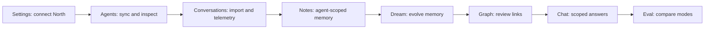

# Sprint D Tasks — Product Polish And Spec Closeout

**Branch**: `sprints/sprint-d`
**Status**: Planning
**Primary spec**: [`specs/openspecs/north-agents-amem.md`](../../specs/openspecs/north-agents-amem.md)
**Companion specs**: [`specs/dreaming.md`](../../specs/dreaming.md), [`specs/datamodel.md`](../../specs/datamodel.md), [`specs/apis.md`](../../specs/apis.md), [`specs/uiux.md`](../../specs/uiux.md), [`specs/userstories.md`](../../specs/userstories.md)
**Depends on**: Sprint C ([`sprint_c_report.md`](../archive/sprint-c/sprint_c_report.md))

## Goals

- Make the North + A-MEM track **demo-ready** end to end: Settings → Agents → Conversations → Notes → Dream → Graph → Chat → Eval.
- Close TD-016 by replacing manual agent UUID entry in chat scope with a first-class agent picker, and preserve agent scope across navigation.
- Tighten loading, empty, error, and success states across agent-scoped surfaces.
- Sync canonical specs to shipped behavior without embedding implementation detail.
- Avoid introducing new platform capabilities; route new ideas to `sprints/backlog.md`.

## Demo Path

---

## Tasks

### Phase 0 — Sprint Setup And Acceptance Audit

- [ ] Branch `sprints/sprint-d` from `main` after Sprint C merge.
- [ ] Confirm Sprint A-C reports and deferred items in [`tech_debt.md`](../tech_debt.md) and [`backlog.md`](../backlog.md).
- [ ] Walk the demo path once on `main` and capture concrete gaps in this file.
- [ ] For each North A-MEM AC (AC-1..AC-4 in [`north-agents-amem.md`](../../specs/openspecs/north-agents-amem.md)), mark must-fix vs follow-up.

**Progress:**

---

### Phase 1 — Chat Agent Scope (TD-016, primary implementation work)

**Why:** Chat is the only A-MEM surface that still requires a pasted UUID. Sprint C wired retrieval scope and audited it; the UX is the remaining gap.

- [ ] Replace the manual agent UUID input in [`apps/web/src/components/chat-scope-picker.tsx`](../../apps/web/src/components/chat-scope-picker.tsx) with `AgentPicker` ([`apps/web/src/components/filters/agent-picker.tsx`](../../apps/web/src/components/filters/agent-picker.tsx)).
- [ ] Carry `agent_id` into chat session creation when arriving from agent-scoped Notes, Graph, or Agent detail (deep-link query param or session-storage handoff).
- [ ] Show the active agent boundary in the chat header / scope summary so users can tell "workspace-wide" from "scoped to North agent X" at a glance.
- [ ] Confirm refusal copy explains the boundary when a question falls outside the selected agent.
- [ ] Add or update unit/typecheck coverage for the new picker wiring; ensure existing chat scope tests still pass.

**Progress:**

---

### Phase 2 — Agent-Scoped Surface Pass

Cross-surface review using the demo path. Aim for small, demo-ready fixes only.

- [ ] **Settings**: North connectivity has clear validation, loading, success, and failure states; token rotation is unambiguous.
- [ ] **Agents**: List shows provider, display name, sync state, and useful timestamps; sync button has progress + result feedback.
- [ ] **Agent detail**: Conversation list states (no credentials / no agents / no conversations / no imports) read well; sync status chips and memory telemetry stay consistent with the panel.
- [ ] **Conversations** (workspace-level): Per-conversation memory telemetry matches Agent detail; sync status is consistent.
- [ ] **Notes**: Agent scope is obvious; clear way back to workspace-wide view.
- [ ] **Graph**: Agent scope is obvious; mixed-source view does not visually imply cross-agent blending under isolation.
- [ ] **Chat**: Scope picker + active boundary surfaced (Phase 1 wire-up).
- [ ] **Jobs**: Dream job rows distinguish from PDF jobs; failure reasons are readable.
- [ ] **Eval**: When agent scope is active, run summaries label the scoping clearly.
- [ ] Lightweight keyboard / screen-reader spot checks for any new controls.

**Progress:**

---

### Phase 3 — Dream And Eval Review Surfaces

- [ ] Confirm Dream job status card shows stats, failures, and recent mutations sufficient for a demo flow.
- [ ] Confirm pipeline log Dream events are actionable: starts, progress, link/neighbor events, completion, failures.
- [ ] Surface recovery guidance for failed Dream runs (read failure reason in the status card; offer retry where safe).
- [ ] Eval result inspection: confirm existing CLI/internal API surfaces are good enough for the demo. If a small read-only panel is needed, scope it tight; otherwise log a follow-up in `backlog.md`.
- [ ] Verify eval-run details surface agent scope.

**Progress:**

---

### Phase 4 — Spec Sync

Update canonical specs to reflect shipped behavior. Keep OpenSpec content implementation-agnostic per [user OpenSpec rules].

- [ ] [`specs/datamodel.md`](../../specs/datamodel.md): Reflect shipped North, A-MEM, dreaming, retrieval, and job fields (e.g. `ingest_content_hash` in `north_metadata`, `dreaming_touched_at`, `evolution_history`, dream job tables, retrieval `agent_id`).
- [ ] [`specs/apis.md`](../../specs/apis.md): Document shipped North, dreaming, eval, retrieval, jobs, and dream-jobs endpoints (paths, methods, response shapes).
- [ ] [`specs/uiux.md`](../../specs/uiux.md): Capture Agents view, Agent detail, agent-scoped Notes/Graph/Chat/Eval, Jobs page, docked pipeline log placements.
- [ ] [`specs/userstories.md`](../../specs/userstories.md): Add or update user stories for North import, A-MEM enrichment, dreaming, agent-scoped chat, and eval with acceptance criteria.
- [ ] [`specs/openspecs/north-agents-amem.md`](../../specs/openspecs/north-agents-amem.md): Re-check AC-1..AC-4 and add any missing acceptance criteria for the shipped UI requirements without leaking implementation.
- [ ] [`specs/dreaming.md`](../../specs/dreaming.md): Cross-check against shipped behavior (no expected changes; confirm).

**Progress:**

---

### Phase 5 — Validation And Closeout

- [ ] Run focused pipeline tests: north import status, dreaming, retrieval scope, eval modes, chat retrieval modes.
- [ ] Run `pnpm exec tsc --noEmit` in `apps/web` and any added smoke tests.
- [ ] Walk the demo path manually once changes land.
- [ ] Log non-critical follow-ups in [`sprints/tech_debt.md`](../tech_debt.md) or [`sprints/backlog.md`](../backlog.md).
- [ ] Write `sprints/sprint-d/sprint_d_report.md` summarizing shipped, deferred, and next.
- [ ] Open PR, merge to `main`, tag `sprint-d`, archive folder under `sprints/archive/sprint-d/`.

**Progress:**

---

## Definition Of Done

- [ ] North A-MEM demo path runs end to end without manual UUID entry or sql.
- [ ] Chat agent scope uses `AgentPicker`; selected agent is preserved across navigation.
- [ ] Agent scope is visible and reversible across Notes, Graph, Chat, and Eval.
- [ ] Canonical specs match shipped behavior; OpenSpec stays implementation-agnostic.
- [ ] Sprint D tests + `tsc --noEmit` green; known gaps logged centrally.
- [ ] Sprint D report and archive complete.

## Notes

- Sprint D explicitly avoids new platform capabilities. New ideas go to `sprints/backlog.md`.
- Eval result UI is intentionally scoped small; a fuller eval product is a backlog item.
- TD-016 is the only carry-over from Sprint C that is implementation work; everything else is review, polish, or documentation.

## Audit Targets (per AC)

| Spec AC | Source | Sprint D check |
| ------- | ------ | -------------- |
| AC-1 (migrations) | `north-agents-amem.md` | Confirm shipped migrations match; note any drift in spec |
| AC-2 (agent-scoped episodes/notes) | `north-agents-amem.md` | Walk import → notes for one agent in demo |
| AC-3 (no cross-agent links) | `north-agents-amem.md` | Verified by Sprint C tests; confirm UI does not imply blending |
| AC-4 (eval + dataset) | `north-agents-amem.md` | Confirm `north_history_v1.yaml` + agent-scoped run path |
| Dreaming ACs | `dreaming.md` | Confirm dream status, mutation count, telemetry, immutability |
