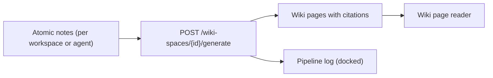

# Sprint E Tasks — LLM Wiki Memory

**Branch**: `sprints/sprint-e`
**Status**: Implementation
**Primary spec**: [`specs/openspecs/llm-wiki-memory.md`](../../specs/openspecs/llm-wiki-memory.md)
**Depends on**: Sprint D ([`sprint_d_report.md`](../archive/sprint-d/sprint_d_report.md))

## Goals

- Ship an MVP **LLM Wiki** memory processor as a pluggable sibling to Dreaming and Graph generation.
- Add a **Wiki** primary-nav item between Graph and Chat.
- Wiki generation runs as an asynchronous job with verbose pipeline telemetry visible on the Wiki page.
- Generated pages cite atomic notes / episodes / documents / conversations / agents.
- Source artifacts remain immutable; every wiki change is auditable.

## Demo Path

---

## Tasks

### Phase 0 — Sprint Setup

- [x] Branch `sprints/sprint-e` from `main`.
- [x] Create `sprints/sprint-e/sprint_e_tasks.md` and `sprint_e_testplan.md`.
- [x] Reference spec at `specs/openspecs/llm-wiki-memory.md`.

### Phase 1 — Data Model + Migration

- [ ] Alembic migration `0015_wiki_memory` adding:
  - `wiki_spaces` (workspace_id, agent_id, scope_kind, scope_target_id, name, status, settings, timestamps)
  - `wiki_pages` (wiki_space_id, slug, title, page_type, body, summary, status, confidence, metadata, timestamps)
  - `wiki_page_sources` (wiki_page_id, source_kind, source_id, quote, weight, created_at)
  - `wiki_generation_jobs` (workspace_id, wiki_space_id, kind, status, stats, failure_reason, timestamps)
  - `wiki_mutations` (wiki_job_id, wiki_page_id, mutation_type, payload, created_at)
  - `wiki_links` (source_page_id, target_page_id, kind, reason, strength, created_at)
- [ ] Pipeline repo module `apps/pipeline/app/wiki_repo.py` with CRUD + scoped queries.

### Phase 2 — Worker + Internal API

- [ ] `apps/pipeline/app/wiki_generation.py`: `run_wiki_generation_job` arq task with verbose telemetry mirroring `dreaming.py` (`record_log`, `publish_job_event`, `record_metric`).
- [ ] Internal HTTP routes (`apps/pipeline/app/internal_wiki.py`):
  - `POST /internal/v1/workspaces/{workspaceId}/wiki-spaces` (create/upsert wiki space)
  - `GET /internal/v1/workspaces/{workspaceId}/wiki-spaces` (list)
  - `GET /internal/v1/workspaces/{workspaceId}/wiki-spaces/{id}` (detail with pages)
  - `POST /internal/v1/workspaces/{workspaceId}/wiki-spaces/{id}/generate` (enqueue job)
  - `GET /internal/v1/workspaces/{workspaceId}/wiki-spaces/{id}/pages/{slug}` (page reader)
  - `GET /internal/v1/workspaces/{workspaceId}/wiki-jobs/{jobId}` (job detail + mutations)
- [ ] Register `run_wiki_generation_job` in `apps/pipeline/app/tasks.py` WorkerSettings.

### Phase 3 — Web UI

- [ ] Web API proxies under `apps/web/src/app/api/v1/workspaces/[workspaceId]/wiki-spaces/...`.
- [ ] Left-rail `Wiki` item between `Graph` and `Chat` ([`apps/web/src/components/left-rail.tsx`](../../apps/web/src/components/left-rail.tsx)).
- [ ] `/wiki` route + workspace-grid integration (dock pipeline log on wiki routes).
- [ ] `wiki-panel.tsx` (list + detail + page reader + citation sidebar + generation controls).
- [ ] `wiki-job-status.tsx` (mirrors `dream-job-status.tsx`).
- [ ] Job kind `wiki_generation` registered in [`apps/web/src/lib/job-events.tsx`](../../apps/web/src/lib/job-events.tsx) and [`apps/web/src/components/job-log-console.tsx`](../../apps/web/src/components/job-log-console.tsx).

### Phase 4 — Tests + Typecheck

- [ ] Pytest for wiki repo + worker telemetry (mirroring `test_dreaming_job.py`).
- [ ] `pnpm exec tsc --noEmit` green in `apps/web`.

### Phase 5 — Closeout

- [ ] `sprint_e_report.md`.
- [ ] Commit, push, PR, merge, tag `sprint-e`, archive `sprints/sprint-e/` to `sprints/archive/sprint-e/`.

---

## Definition Of Done

- [ ] Migration applies cleanly and matches the spec data model.
- [ ] User can click `Wiki` in the left rail (between Graph and Chat) and reach a working wiki list/detail surface.
- [ ] User can generate a wiki for a workspace (and optionally for one North agent).
- [ ] Wiki generation publishes verbose telemetry visible in the docked pipeline log on the Wiki page.
- [ ] Generated wiki pages carry citations to source atomic notes / episodes / documents / conversations / agents.
- [ ] Wiki generation does not mutate any source artifact.
- [ ] Sprint E tests + web typecheck pass.

## Deferred to Later Sprints

- Retrieval over wiki pages (chat / hybrid mode that reads wiki).
- Full lint operation with contradiction detection across pages.
- Markdown / Obsidian export.
- Per-document and per-conversation scoped wikis (MVP supports `workspace` and `agent` scopes).
- LLM-driven page synthesis quality tuning (initial version uses straightforward note clustering by tag/topic with model-assisted page bodies).
