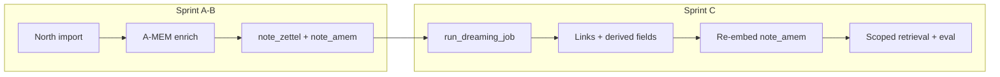

# Sprint C Tasks — Dreaming, Eval Modes, And Isolation

**Branch**: `sprints/sprint-c`
**Status**: In progress (branch created from `main` @ Sprint B merge)
**Primary spec**: [`specs/openspecs/north-agents-amem.md`](../../specs/openspecs/north-agents-amem.md) — **FR-6**, **FR-8**, **FR-9**, **FR-10**
**Depends on**: Sprint B ([`sprint_b_report.md`](../archive/sprint-b/sprint_b_report.md)) — A-MEM enrichment, `note_amem` / `note_zettel` indexes, `AgentPicker`, graph `agent_id` filter

## Goals

- Run **agent-scoped dreaming** jobs that evolve derived memory fields without mutating immutable source text.
- Enforce **strict agent isolation** across note links, retrieval hits, citations, and eval runs.
- Verify and harden **retrieval mode** comparisons (`raw_transcript`, `zettelkasten_notes`, `amem_lite`, `graph`, `hybrid`) under optional `agent_id` scope.
- Provide **auditable** dreaming mutations at job and per-note levels.

## Baseline (already on `main` — verify and harden, do not re-build)

Sprint 6c + Sprint B shipped substantial scaffolding. Sprint C **productionizes and tests** these paths:

| Area | Existing modules / behavior |
| ---- | --------------------------- |
| Schema | Migration [`0011_north_agents_amem.py`](../../apps/migrations/alembic/versions/0011_north_agents_amem.py): `dream_jobs`, `dream_job_mutations`, `note_links.link_reason` / `link_strength`, `evolution_history`, `dreaming_touched_at` |
| Dreaming worker | [`dreaming.py`](../../apps/pipeline/app/dreaming.py) — `run_dreaming_job`: agent-scoped `list_notes`, cosine neighbors, LLM decisions, `add_note_link`, `patch_note_derivations` + `append_evolution_history`, `upsert_amem_embeddings_for_notes` |
| Dream enqueue | [`internal_north.py`](../../apps/pipeline/app/internal_north.py) `POST .../dream` → arq `run_dreaming_job`; web proxy + Agents **Dream** button |
| Link isolation | [`notes_repo.add_note_link`](../../apps/pipeline/app/notes_repo.py) rejects `cross_agent_link_forbidden` when both endpoints have different non-null `agent_id` |
| Link UI | [`note-detail.tsx`](../../apps/web/src/components/note-detail.tsx) shows `link_reason` on inbound/outbound links |
| Retrieval modes | [`chat_turn._retrieve`](../../apps/pipeline/app/chat_turn.py) dispatches `rag`/`raw_transcript`, `graph`, `hybrid`, `zettelkasten_notes`, `amem_lite` |
| Agent-scoped search | [`retrieval_embeddings_repo.search_by_kind`](../../apps/pipeline/app/retrieval_embeddings_repo.py) `agent_id` filter; [`chat_retrieval_raw`](../../apps/pipeline/app/chat_retrieval_raw.py), [`chat_retrieval_notes_vector`](../../apps/pipeline/app/chat_retrieval_notes_vector.py), [`chat_retrieval_graph`](../../apps/pipeline/app/chat_retrieval_graph.py) pass `scope.agent_id` where applicable |
| Eval harness | [`eval/runner.py`](../../apps/pipeline/app/eval/runner.py) accepts `agent_id`; [`eval/datasets/north_history_v1.yaml`](../../apps/pipeline/app/eval/datasets/north_history_v1.yaml) stub dataset with five categories |
| Eval tables | Migration [`0010_retrieval_eval_indexes`](../../apps/migrations/alembic/versions/0010_retrieval_eval_indexes.py): `chat_eval_runs`, `chat_eval_questions`, `chat_eval_results` |

**Explicitly out of scope (Sprint D):** full product polish across Settings/Chat/Eval chrome, spec sync to [`specs/datamodel.md`](../../specs/datamodel.md) / [`specs/apis.md`](../../specs/apis.md), rich dreaming review dashboards, and broad empty-state copy passes — unless a minimal read-only endpoint is required to validate Sprint C behavior.

---

## Tasks

### Phase 0 — Sprint setup

- [x] Branch `sprints/sprint-c` from updated `main` after Sprint B merge (`45ae42d`).
- [ ] Confirm Sprint B: North notes have `memory_context` / `memory_keywords` and `note_amem` rows after import + backfill.
- [ ] Review [`north-agents-amem.md`](../../specs/openspecs/north-agents-amem.md) FR-6, FR-8, FR-9, FR-10.
- [ ] Keep progress notes under each phase as work proceeds.

**Progress:**

---

### Phase 1 — Memory links and isolation

**Target:** FR-6, NFR-1 — link metadata + no cross-agent edges.

- [ ] **Confirm schema** — `note_links` has `link_reason`, `link_strength`; ingestion already passes them from [`tasks.py`](../../apps/pipeline/app/tasks.py) note-link suggestions.
- [ ] **Harden `add_note_link`** — document behavior when one endpoint has `agent_id` null (PDF) and the other is North-scoped (allow vs reject); align with spec “cross-agent research mode” default **off**.
- [ ] **List links API** — ensure note detail / internal routes return `link_reason` and `link_strength` for graph and note UIs (verify [`internal_notes`](../../apps/pipeline/app/internal_notes.py) serializers).
- [ ] **Regression tests** — `test_note_link_isolation.py`:
  - same-agent link succeeds;
  - cross-agent (two non-null different `agent_id`) raises `cross_agent_link_forbidden`;
  - self-link rejected;
  - legacy null-null PDF links still allowed if product decision says so.
- [ ] **Optional:** reject link when exactly one side has `agent_id` (stricter isolation) — document choice in Progress.

**Key files:** [`notes_repo.py`](../../apps/pipeline/app/notes_repo.py), [`note-detail.tsx`](../../apps/web/src/components/note-detail.tsx)

**Progress:**

---

### Phase 2 — Dreaming jobs (productionize)

**Target:** FR-8, NFR-2, NFR-3 — audited, agent-scoped, immutable bodies.

- [ ] **Job lifecycle API** — add internal routes:
  - `GET .../north/agents/{agent_id}/dream-jobs` (recent jobs, status, stats, `failure_reason`);
  - `GET .../dream-jobs/{job_id}` (detail + `dream_job_mutations` list);
  - web proxies under `apps/web/src/app/api/v1/workspaces/.../`.
- [ ] **Wire arq** — confirm `run_dreaming_job` registered in [`tasks.WorkerSettings`](../../apps/pipeline/app/tasks.py); job id prefix `dream:{agent_id}:...` for log correlation.
- [ ] **Pipeline settings caps** — add `dreaming_max_notes`, `dreaming_neighbors_per_note`, `dreaming_pairs_per_run` (or equivalent) in `pipeline_settings` with sane defaults (today hard-coded: 60 notes, 6 neighbors).
- [ ] **Immutability guard** — after each `patch_note_derivations`, re-fetch note and assert `title` / `body` unchanged; log violation and skip mutation row on failure.
- [ ] **Job telemetry** — optional `record_log` / metrics via Redis when dreaming runs under a traceable `job_id` (or document in `dream_jobs.stats` only if SSE is out of scope).
- [ ] **Status vocabulary** — align `dream_jobs.status` values (`running` / `succeeded` / `failed`) across worker, API, and UI; fix `finalize_dream_job` if insert uses inconsistent literals.
- [ ] **Minimal UI** (not Sprint D polish): on agent detail or Agents list, after **Dream** enqueue show last job status + link to mutations (read-only); loading/error states.

**Key files:** [`dreaming.py`](../../apps/pipeline/app/dreaming.py), [`north_repo.py`](../../apps/pipeline/app/north_repo.py), [`internal_north.py`](../../apps/pipeline/app/internal_north.py), [`agent-detail-panel.tsx`](../../apps/web/src/components/agent-detail-panel.tsx)

**Progress:**

---

### Phase 3 — Re-embedding and reindexing

**Target:** FR-8 — derived-field changes refresh `note_amem` retrieval text.

- [ ] **Verify post-dream path** — [`dreaming.py`](../../apps/pipeline/app/dreaming.py) already calls `upsert_amem_embeddings_for_notes` for touched note ids; confirm `_amem_text` includes updated `memory_context` / `memory_keywords`.
- [ ] **Idempotent upsert** — rely on `retrieval_embeddings` unique `(workspace_id, index_kind, source_id)`; add test that second reindex overwrites embedding row without duplicate rows.
- [ ] **Stats** — extend `dream_jobs.stats` with `embeddings_refreshed`, `notes_considered`, `pairs_considered` (align naming with spec flow).
- [ ] **Optional zettel reindex** — only if dreaming ever changes `title`/`body` (it must not); otherwise document “zettel unchanged by design”.

**Key files:** [`note_embedding_index.py`](../../apps/pipeline/app/note_embedding_index.py), [`dreaming.py`](../../apps/pipeline/app/dreaming.py)

**Progress:**

---

### Phase 4 — Retrieval mode expansion and agent scope

**Target:** FR-9, NFR-1 — no cross-agent blending when `agent_id` is active.

- [ ] **Mode matrix** — document and test each mode with `scope.agent_id` set:

| Mode | Module | Agent filter today |
| ---- | ------ | ------------------ |
| `rag` / `raw_transcript` | `chat_retrieval_raw` | `search_by_kind` + `agent_id` on `raw_chunk` rows |
| `zettelkasten_notes` | `retrieve_zettel` | `note_zettel` + `agent_id` |
| `amem_lite` | `retrieve_amem` | `note_amem` + `agent_id` |
| `graph` | `chat_retrieval_graph` | Graphiti search + graph context; verify episode/agent filtering |
| `hybrid` | `chat_retrieval_hybrid` | inherits graph + traversal; verify no PDF-only leakage when scoped |

- [ ] **Chat turn** — ensure `effective_scope_snapshot` / session scope can include `agent_id` (light touch: pass through from scope picker if trivial; else document as Sprint D).
- [ ] **Retrieval records** — persist `agent_id` (or full scope JSON) on `retrieval_records` for inspector / eval audit.
- [ ] **Citations** — verify citation `source_id` prefixes resolve only within scoped corpus when `agent_id` set.
- [ ] **Tests** — `test_retrieval_agent_scope.py` with mocked embeddings or fixture workspace: scoped search excludes other agent’s `note_amem` / `raw_chunk` rows.

**Key files:** [`chat_turn.py`](../../apps/pipeline/app/chat_turn.py), [`chat_retrieval_*.py`](../../apps/pipeline/app/), [`retrieval_embeddings_repo.py`](../../apps/pipeline/app/retrieval_embeddings_repo.py)

**Progress:**

---

### Phase 5 — North-history eval dataset

**Target:** FR-10 — categorized questions under agent scope.

- [ ] **Expand [`north_history_v1.yaml`](../../apps/pipeline/app/eval/datasets/north_history_v1.yaml)** — add fixture notes/transcript snippets or document required workspace seed script; ensure categories cover: `single_hop`, `multi_hop`, `temporal`, `tool_provenance`, `unanswerable`.
- [ ] **Eval runner defaults** — extend [`DEFAULT_MODES`](../../apps/pipeline/app/eval/runner.py) to include `zettelkasten_notes`, `amem_lite`, and `raw_transcript` alongside `rag`, `graph`, `hybrid` for North comparisons.
- [ ] **CLI / internal API** — confirm `StartEvalBody.agent_id` flows from [`internal_eval.py`](../../apps/pipeline/app/internal_eval.py) through `_answer_one`.
- [ ] **Scoring** — verify [`eval/scoring.py`](../../apps/pipeline/app/eval/scoring.py) handles `refusal_expected` for unanswerable rows; citation recall when agent scope empty.
- [ ] **Web eval UI** (minimal) — if compare panel exists, add optional **Agent** filter using `AgentPicker` + pass `agent_id` to eval start (defer full polish to Sprint D).

**Key files:** [`eval/runner.py`](../../apps/pipeline/app/eval/runner.py), [`eval/datasets/north_history_v1.yaml`](../../apps/pipeline/app/eval/datasets/north_history_v1.yaml), [`internal_eval.py`](../../apps/pipeline/app/internal_eval.py)

**Progress:**

---

### Phase 6 — Tests and closeout

- [ ] **`test_dreaming_job.py`** — mock LLM + embedder: job row created, mutations written, `dreaming_touched_at` set only on neighbor patch, bodies unchanged, `finalize_dream_job` stats.
- [ ] **`test_note_link_isolation.py`** — see Phase 1.
- [ ] **`test_retrieval_agent_scope.py`** — see Phase 4.
- [ ] **Regression** — Sprint B tests + North transcript tests still pass.
- [ ] **Web** — `pnpm exec tsc --noEmit` in `apps/web`.
- [ ] **Manual smoke** (operator):
  1. Import North conversation → run A-MEM enrich (Sprint B) → **Dream** on agent.
  2. Inspect `dream_job_mutations` (API or DB) — links have `link_reason`; neighbor notes show `dreaming_touched_at`.
  3. Scoped **Graph** / **Notes** with `AgentPicker` — no other agent’s artifacts.
  4. Run eval with `north_history_v1` + `agent_id` — modes complete without cross-agent citations.
- [ ] Log accepted limitations in [`tech_debt.md`](../tech_debt.md) if any.

**Progress:**

---

## Definition of done

- [ ] Dreaming runs for one agent without mutating note `body` or episode source text.
- [ ] Dreaming mutations are auditable (`dream_jobs` + `dream_job_mutations` + `evolution_history`).
- [ ] Retrieval and eval respect active `agent_id` across supported modes.
- [ ] Cross-agent note links are rejected (two non-null different agents).
- [ ] North-history eval dataset runs with agent scope and planned retrieval modes.
- [ ] Sprint C automated tests pass; web typecheck green.

---

## Sprint review (fill at closeout)

**Demo readiness:**

**Gaps / issues:**

**Next steps:** Sprint D — product polish, agent-scoped Chat/Eval UX, spec sync ([`sprint_d_tasks.md`](../sprint-d/sprint_d_tasks.md)).

---

## Notes

- **Transparency:** Prefer inspectable `dream_jobs` / mutation list over black-box **Dream** button; minimal read-only status is in scope for Sprint C.
- **Eval dataset:** `north_history_v1.yaml` is a starting point; Sprint C may add a small seed fixture or documented manual seed steps rather than full synthetic corpus generation.
- **Chat scope:** Full `agent_id` in chat scope picker is Sprint D unless trivial to pass existing eval/chat scope JSON through.
