# zkast — Master Sprint Plan

This document is the **implementation roadmap** derived from the specifications in [specs/](../specs/). It does not replace those specs; it sequences work into **eight P0 two-week sprints** (~16 weeks solo dev + AI), plus a **P1 outline** (five future sprints). **P2** items live only in [backlog.md](backlog.md).

## Vision (from specs)

zkast turns PDFs into **atomic Zettelkasten notes**, a **working knowledge graph** (Graphiti-backed), **grounded chat** with citations (Cohere), and optional **persistence** to user-owned **Neo4j** or **Postgres + Apache AGE**. See [prd.md](../specs/prd.md).

## Cadence and workflow

- **Sprint length**: 2 weeks.
- **Team**: Solo developer + AI assistant.
- **Artifacts per sprint**: `sprints/sprint_N/sprint_N_tasks.md` — track progress with `[ ]` / `[x]` and Progress notes under tasks as you go.
- **Central logs**: [backlog.md](backlog.md), [tech_debt.md](tech_debt.md), [bug_swatting.md](bug_swatting.md).
- **Optional** (not created upfront): per-sprint test plans, updates logs, reports — add when needed.

## Specification index

| Document | Purpose |
| -------- | ------- |
| [prd.md](../specs/prd.md) | Goals, FR/NFR, phases P0/P1/P2 |
| [personas.md](../specs/personas.md) | Personas and flows |
| [userstories.md](../specs/userstories.md) | Epics, US-x.y, acceptance criteria |
| [datamodel.md](../specs/datamodel.md) | Entities, ERD, external-graph contract |
| [techstack.md](../specs/techstack.md) | Next.js 14, FastAPI, Graphiti, Cohere, FalkorDB, etc. |
| [apis.md](../specs/apis.md) | HTTP contracts, jobs, SSE |
| [uiux.md](../specs/uiux.md) | IA, panels, design tokens, a11y checklist |

## P0 sprint dependency graph

```mermaid
flowchart LR
    S1[Sprint 1 Foundation] --> S2[Sprint 2 Cohere Graphiti]
    S2 --> S3[Sprint 3 PDF Ingest]
    S3 --> S4[Sprint 4 Notes Graph]
    S4 --> S5[Sprint 5 Viz Edit]
    S5 --> S5b[Sprint 5b Observability]
    S5b --> S5c[Sprint 5c Typed KG + Filter UX]
    S5c --> S6[Sprint 6 Chat Core]
    S6 --> S6b[Sprint 6b GraphRAG vs RAG eval]
    S6b --> S7[Sprint 7 Chat UX Persist]
    S7 --> S8[Sprint 8 Polish Release]
```

## P0 — Sprint summaries

| Sprint | Folder | Focus | Primary spec anchors |
| ------ | ------ | ----- | -------------------- |
| 1 | [sprint_1/](sprint_1/sprint_1_tasks.md) | Monorepo, Docker Compose, app shell, bypass auth, secrets, OTEL stubs, design tokens | NFR-1, NFR-3, NFR-7, FR-33, [uiux.md](../specs/uiux.md) Visual Design System |
| 2 | [sprint_2/](sprint_2/sprint_2_tasks.md) | Cohere (Chat/Embed/Rerank), Graphiti + FalkorDB, ApiKey encryption, first-run | FR-29, FR-30, [techstack.md](../specs/techstack.md) |
| 3 | [sprint_3/](sprint_3/sprint_3_tasks.md) | PDF upload, Episodes, IngestionRun, SSE progress | FR-1–FR-4, US-1.1–US-1.3 |
| 4 | [sprint_4/](sprint_4/sprint_4_tasks.md) | Atomic notes, entities/relationships, Notes UI, re-ingest/delete (**closed 2026-05-12** — [report](sprint_4/sprint_4_report.md)) | FR-5–FR-15, US-1.4–US-1.5, US-2.x |
| 5 | [sprint_5/](sprint_5/sprint_5_tasks.md) | Graph viz (`react-force-graph`), filters, provenance, merge/split, snapshots | FR-16–FR-22, US-2.3–US-2.4, US-3.x |
| 5b | [sprint_5b/](sprint_5b/sprint_5b_tasks.md) | Ingestion observability, heartbeat reconciler, streaming log drawer, merge undo, hidden-attribute filter, snapshot review, diagnostics page | TD-001–TD-009, BUG-001–BUG-009 |
| 5c | [sprint_5c/](sprint_5c/sprint_5c_tasks.md) | Typed Graphiti extraction, LangExtract evidence (char-offset quotes), graph filter UX (no UUIDs) | FR-16, FR-18 (typed types), US-2.7 evidence, US-3.2 pickers, US-3.7 taxonomy, TD-010 follow-up |
| 6 | [sprint_6/](sprint_6/sprint_6_tasks.md) | Chat data model, retrieval, Cohere v2 grounded chat with documents + citations, SSE streaming with 7 event types, refusal, cooperative stop, graph-context grounding document (BUG-013 mitigation), workspace layout overhaul (**shipped — tag `sprint-6`**, [report](sprint_6/sprint_6_report.md)) | FR-35–FR-39, FR-41, FR-45, US-8.1–US-8.2, US-8.4, US-8.8–US-8.9 |
| 6b | [sprint_6b/](sprint_6b/sprint_6b_tasks.md) _(planning)_ | GraphRAG vs naive-RAG evaluation harness **plus** the deterministic traversal handlers that make the comparison interesting: typed-question taxonomy (vector-friendly, aggregation, multi-hop), `chat_messages.retrieval_mode` toggle (`graph` / `rag` / `hybrid`), canned question set, side-by-side comparison view, intent routing + typed-entity / multi-hop handlers (TD-015). Pin SM-6 with quantitative deltas vs naive RAG. | Sprint 6 chat foundation; **TD-015** is the long-term fix tracked here |
| 7 | [sprint_7/](sprint_7/sprint_7_tasks.md) | Chat Home/Drawer/View, citations UX, targets, persistence writer | FR-23–FR-28, US-4.x, US-8.3, US-8.5–US-8.7 |
| 8 | [sprint_8/](sprint_8/sprint_8_tasks.md) | Cancel jobs, command palette, a11y pass, perf budgets, Docker hardening, v0.1.0 | NFR-4–NFR-11, US-7.x, [uiux.md](../specs/uiux.md) checklist |

## P0 — Phase success criteria

Aligned with [prd.md](../specs/prd.md) Phase 0:

- [ ] `docker compose up` runs web + pipeline + Postgres + Redis + FalkorDB with single-user bypass (FR-33, NFR-1).
- [ ] User can upload PDF(s), see ingestion stages, and inspect Episodes with page provenance (FR-1–FR-3).
- [ ] Pipeline produces AtomicNotes + working graph (Entities/Relationships) with provenance (FR-7–FR-15).
- [ ] User can visualize, filter, edit graph; create GraphSnapshots (FR-17–FR-22).
- [ ] User can chat with grounded answers, citations, retrieval inspector, streaming + stop (FR-35–FR-45).
- [ ] User can configure Neo4j or Postgres+AGE target and persist a snapshot (upsert default; replace with dry-run) (FR-23–FR-28).
- [ ] Cohere-only LLM path works end-to-end (FR-29–FR-30 P0 scope).
- [ ] WCAG 2.1 AA targets met; design tokens from [uiux.md](../specs/uiux.md) respected.
- [ ] Telemetry/opt-out story matches NFR-2; Graphiti telemetry forced off in self-hosted builds.

## P1 outline (future — no per-sprint folders yet)

| Sprint | Theme |
| ------ | ----- |
| 9 | Multi-user auth, memberships, roles, invitations, audit log (Epic 6, [userstories.md](../specs/userstories.md)) |
| 10 | Custom entity/edge types; chat Markdown export; workspace-shared chat sessions (US-3.7, US-8.10–US-8.11) |
| 11 | Additional LLM providers; Gemini path + LangExtract integration ([techstack.md](../specs/techstack.md)) |
| 12 | API key rotation polish; pipeline tuning UI (US-5.3–US-5.4) |
| 13 | Snapshot rollback/diff; persistence history; compare-with-snapshot (US-4.4) |

## Release tagging

- End of **Sprint 8**: tag **`v0.1.0`** — P0 MVP self-hosted single-user.

## Related

- Sprint task files: `sprint_N/sprint_N_tasks.md` for N = 1..8.
- Backlog (P2): [backlog.md](backlog.md).
